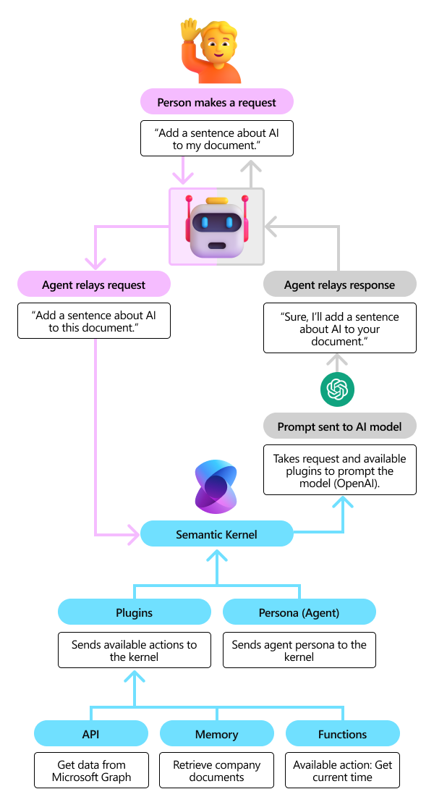

# What is a Plugin?

:::row:::
   :::column span="2":::
        
   :::column-end:::
   :::column span="1":::
     Plugins are the fundamental building blocks of Semantic Kernel. If you have already used plugins from ChatGPT, Bing, or Microsoft 365, you’re already familiar with them. With plugins, you encapsulate capabilities into a single unit of functionality that is used by an AI. Because plugins are the same across all platforms, you can bring these same plugins to your own AI powered applications with Semantic Kernel.
   :::column-end:::
:::row-end:::

Plugins are highly adaptable; they can consist of both native code and requests to AI services via prompts. Examples include:
•	Web search plugin: Gives the AI the ability to search the web for current information that might not exist in its training data.
•	CRM plugin: Allows an AI to retrieve information about customers and make adjustments as new information comes in.
•	Email plugin: Let’s an AI send and receive emails on behalf of a user.
•	Inventory plugins: Gives an AI the ability to see what is in stock so it can give recommendations to employees and customers alike.
•	Image generation plugin: You can augment an AI with capabilities from other AI models, like a text-to-image service.
•	Microsoft 365 Plugin: Allows an AI to use Microsoft 365 applications, such as Microsoft Word so that it can edit documents on behalf of a user.

Using plugins with Semantic Kernel
What makes Semantic Kernel powerful is its ability to combine a user’s request with your available plugins. In the following example, a User sends a request to an agent. The agent then relays the request to Semantic Kernel where it’s combined with the power of plugins and a persona.

Within each plugin, you can give actions to the agent. These actions could be API calls (e.g., get data from Microsoft graph), access to memory (e.g., get answers from documents) or native functions (e.g., get the current time).
Once these plugins are defined, Semantic Kernel can send a single prompt that combines the user request and your plugins to an AI Model (OpenAI ChatGPT, Azure OpenAI, Gemini, Mistral AI, etc.) so it can plan the best way to achieve the user’s goal. Finally, the agent relays the AI response back to the user.
How you could recreate Microsoft Word Copilot
You’re likely familiar with Microsoft Word and other M365 productivity apps. Plugins are a key component to how the Copilots work in these apps. The following scenario focuses on how Word uses plugins to respond to a user’s request to add a paragraph on the history of AI to an existing document. In this example, we’ve given the Word Copilot access to plugins to search the web, retrieve previous memories about the document, and the ability to manipulate the doc.

For this scenario, the AI can use these plugins to search the web for history about AI, recall other references about AI in the current doc, and add a new paragraph with the final content. As the AI model decides that it wants to use these plugins, it sends a request to Semantic Kernel to invoke the plugins.
Once the AI is done performing the actions, it can relay a final response from the AI back to the user telling them that the paragraph has been added to the Word document.
Building your own Copilot with Semantic Kernel
If you want to build your own Copilot within your AI powered application, you can follow a similar pattern as the Microsoft 365 Copilots. The only difference is that you’ll provide Semantic Kernel with your own custom plugins. In the following diagram, we demonstrate how you can create plugins that call your existing app service.

In the above example, the user asks the AI to create an infographic. To support this type of scenario, you would need to provide Semantic Kernel with an order plugin that can pull the relevant information from a database like Cosmos. You likely already have APIs that support these scenarios, so building these plugins should be easy!

