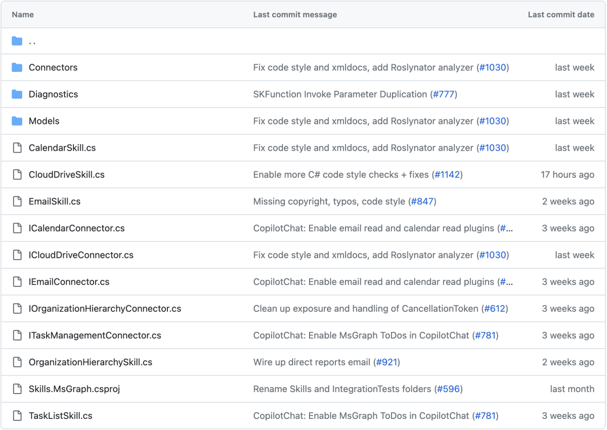

# What are Connectors?

[!INCLUDE [pat_large.md](../includes/pat_large.md)]

_Connectors_ let you reach outside of the plugins universe to external APIs and whatever else you can imagine. By combining your custom plugins with a custom set of connectors, you can build LLM AI app features that fully leverage realtime data into fully reusable "AI ready" components to add to all of your projects. 

## Connect Semantic Kernel to Microsoft Graph

The [Microsoft Graph Connector Kit](https://github.com/microsoft/semantic-kernel/tree/main/dotnet/src/Skills/Skills.MsGraph) lets you fluidly connect with useful data that's only available to you when securely logged-in. We currently support your ability to:

* Add an event to your calendar
* Send an email for you
* Add a file to your OneDrive
* Create a share link to a file in your OneDrive
* Query your organization hierarchy
* Manage your Microsoft To Do list
* And more!

To see the Microsoft Graph Connector Kit in action, check out the [Authentication API sample](../samples-and-solutions/authentication-api.md). The sample highlights connecting to Microsoft Graph and calling APIs for Outlook, OneDrive, and To Do

## More out-of-the-box connectors

* Issue a [Bing or Google search query](https://github.com/microsoft/semantic-kernel/tree/main/dotnet/src/Skills/Skills.Web)
* Read [OpenXML streams](https://github.com/microsoft/semantic-kernel/tree/main/dotnet/src/Skills/Skills.Document) (e.g. Word docs)
* Make a [REST API call](https://github.com/microsoft/semantic-kernel/tree/main/dotnet/src/Skills/Skills.OpenAPI) using OpenAPI

The set of example connectors provided in the [repo](https://github.com/microsoft/semantic-kernel/tree/main/dotnet/src) have designed to start you on your path to building your own external interfaces to Semantic Kernel.

## Take the next step

> [!div class="nextstepaction"]
> [Automatically create chains with planner](./planner.md)
