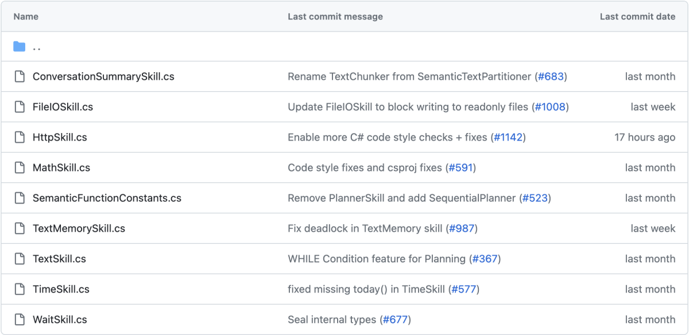

# Core plugins are always ready to be accessed

[!INCLUDE [pat_large.md](../includes/pat_large.md)]


> [!Note]
> Skills are currently being renamed to plugins. This article has been updated to reflect the latest terminology, but some images and code samples may still refer to skills.

To provide a degree of standardization across Semantic Kernel implementations, the GitHub repo has several plugins available to any Semantic Kernel prompt which you view on the [Semantic Kernel GitHub repo](https://github.com/microsoft/semantic-kernel/tree/main/dotnet/src/SemanticKernel/CoreSkills).



The core plugins currently supported include:

* `ConversationSummarySkill`: To summarize a conversation
* `FileIOSkill`: To read and write to the filesystem
* `HttpSkill`: To call APIs
* `MathSkill`: To perform mathematical operations
* `TextMemorySkill`: To store and retrieve text in memory
* `TextSkill`: To deterministically manipulating text strings
* `TimeSkill`: To acquire the time of day and any other temporal information
* `WaitSkill`: To pause execution for a specified amount of time


## Example of how a core plugin is used in Semantic Kernel

When using a core plugin, be sure to include a `using Microsoft.SemanticKernel.CoreSkills`:

```csharp
using Microsoft.SemanticKernel.CoreSkills;

// ( You want to instantiate a kernel and configure it first )

myKernel.ImportSkill(new TimeSkill(), "time");

const string ThePromptTemplate = @"
Today is: {{time.Date}}
Current time is: {{time.Time}}

Answer to the following questions using JSON syntax, including the data used.
Is it morning, afternoon, evening, or night (morning/afternoon/evening/night)?
Is it weekend time (weekend/not weekend)?";

var myKindOfDay = myKernel.CreateSemanticFunction(ThePromptTemplate, maxTokens: 150);

var myOutput = await myKindOfDay.InvokeAsync();
Console.WriteLine(myOutput);
```

The output is what you would expect when you read `ThePromptTemplate` to be:

```resulting-output
{
  "date": "Monday, February 20, 2023",
  "time": "01:27:44 PM",
  "period": "afternoon",
  "weekend": "not weekend"
}
```

### Chaining example with core plugins

Using the core `TextSkill` it's easy to transform text by modifying it sequentially:

```csharp
using Microsoft.SemanticKernel;
using Microsoft.SemanticKernel.Orchestration;
using Microsoft.SemanticKernel.CoreSkills;

var myKernel = Kernel.Builder.Build();

var myText = myKernel.ImportSkill(new TextSkill());

SKContext myOutput = await myKernel.RunAsync(
    "    i n f i n i t e     s p a c e     ",
    myText["TrimStart"],
    myText["TrimEnd"],
    myText["Uppercase"]);

Console.WriteLine(myOutput);
```

Note how the input streams through a pipeline of three functions executed serially. Expressed sequentially as in a chain of functions:

| "   i n f i n i t e    s p a c e    " → | TextSkill.TrimStart → | TextSkill.TrimEnd → | TextSkill.Uppercase → |
|---|---|---|---|

The output reads as:

`I N F I N I T E     S P A C E`

### Take the next step

> [!div class="nextstepaction"]
> [Deploy your plugins to Azure](../deploy/deploy-to-azure.md)
