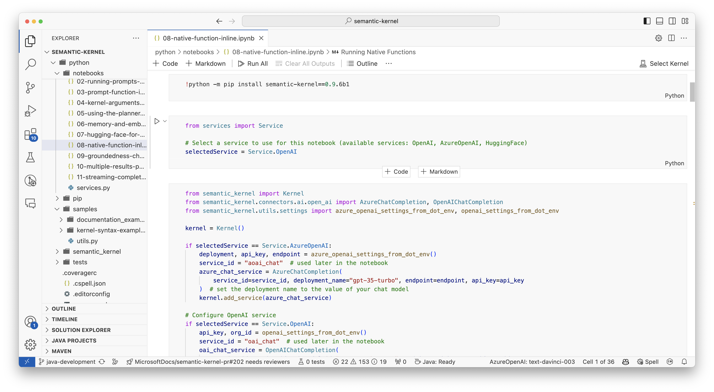
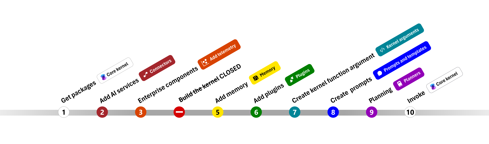
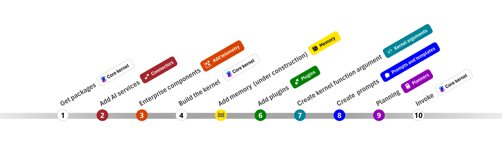
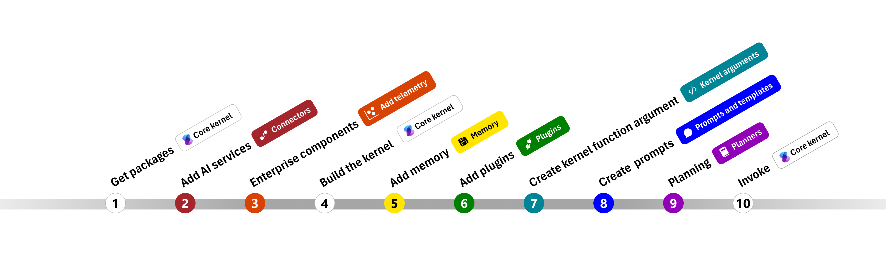

# Getting started with Semantic Kernel


In just a few steps, you can build your first AI agent with Semantic Kernel in either Python, .NET, or Java. This guide will show you how to...
- Install the necessary packages
- Create a back-and-forth conversation with an AI
- Give an AI agent the ability to run your code
- Watch the AI create plans on the fly

## Installing the SDK

::: zone pivot="programming-language-csharp"

Semantic Kernel has several NuGet packages available. For most scenarios, however, you typically only need `Microsoft.SemanticKernel`.

You can install it using the following command:

```bash
dotnet add package Microsoft.SemanticKernel
```

For the full list of Nuget packages, please refer to the [supported languages article](./supported-languages.md).

::: zone-end  


::: zone pivot="programming-language-python"

Instructions for accessing the `SemanticKernel` Python package is available [here](https://pypi.org/project/semantic-kernel/). It's as easy as:

```PyPI
pip install semantic-kernel
```

::: zone-end

::: zone pivot="programming-language-java"

The `SemanticKernel` bom can be found on [maven](https://repo1.maven.org/maven2/com/microsoft/semantic-kernel/semantickernel-bom/). Using the package is as easy as adding the following to your _pom.xml_ file:

```xml
<dependencyManagement>
    <dependencies>
        <dependency>
            <groupId>com.microsoft.semantic-kernel</groupId>
            <artifactId>semantickernel-bom</artifactId>
            <version>${semantickernel.version}</version>
            <scope>import</scope>
            <type>pom</type>
        </dependency>
    </dependencies>
</dependencyManagement>

<dependency>
    <groupId>com.microsoft.semantic-kernel</groupId>
    <artifactId>semantickernel-api</artifactId>
</dependency>
```
::: zone-end


::: zone pivot="programming-language-python,programming-language-csharp"
## Quickly get started with notebooks
If you're a Python or C# developer, you can quickly get started with our notebooks. These notebooks provide step-by-step guides on how to use Semantic Kernel to build AI agents.



::: zone-end

::: zone pivot="programming-language-python"
To get started, follow these steps:
1. Clone the [Semantic Kernel repo](https://github.com/microsoft/semantic-kernel)
2. Open the repo in Visual Studio Code
3. Navigate to [_/python/samples/getting_started](https://github.com/microsoft/semantic-kernel/tree/main/python/samples/getting_started)
4. Open _00-getting-started.ipynb_ to get started setting your environment and creating your first AI agent!
::: zone-end

::: zone pivot="programming-language-python"
To get started, follow these steps:
1. Clone the [Semantic Kernel repo](https://github.com/microsoft/semantic-kernel)
2. Open the repo in Visual Studio Code
3. Navigate to [_/dotnet/notebooks](https://github.com/microsoft/semantic-kernel/tree/main/dotnet/notebooks)
4. Open _00-getting-started.ipynb_ to get started setting your environment and creating your first AI agent!
::: zone-end


## Writing your first console app

::: zone pivot="programming-language-csharp"
```csharp
// Import packages
using Microsoft.SemanticKernel;
using Microsoft.SemanticKernel.ChatCompletion;
using Microsoft.SemanticKernel.Connectors.OpenAI;

// Create a kernel with Azure OpenAI chat completion
var builder = Kernel.CreateBuilder().AddAzureOpenAIChatCompletion(modelId, endpoint, apiKey);

// Add enterprise components
builder.Services.AddLogging(services => services.AddConsole().SetMinimumLevel(LogLevel.Trace));

// Build the kernel
Kernel kernel = builder.Build();
var chatCompletionService = kernel.GetRequiredService<IChatCompletionService>();

// Add a plugin (the LightsPlugin class is defined below)
kernel.Plugins.AddFromType<LightsPlugin>();

// Enable planning
OpenAIPromptExecutionSettings openAIPromptExecutionSettings = new() 
{
    ToolCallBehavior = ToolCallBehavior.AutoInvokeKernelFunctions
};

// Create a history store the conversation
var history = new ChatHistory();

// Initiate a back-and-forth chat
string? userInput;
do {
    // Collect user input
    Console.Write("User > ");
    userInput = Console.ReadLine();

    // Add user input
    history.AddUserMessage(userInput);

    // Get the response from the AI
    var result = await chatCompletionService.GetChatMessageContentAsync(
        history,
        executionSettings: openAIPromptExecutionSettings,
        kernel: kernel);

    // Print the results
    Console.WriteLine("Assistant > " + result);

    // Add the message from the agent to the chat history
    history.AddMessage(result.Role, result.Content ?? string.Empty);
} while (userInput is not null)
```
::: zone-end


::: zone pivot="programming-language-python"
```python
from semantic_kernel import Kernel
from semantic_kernel.functions import kernel_function
from semantic_kernel.connectors.ai.open_ai import AzureChatCompletion
from semantic_kernel.connectors.ai.function_call_behavior import FunctionCallBehavior
from semantic_kernel.connectors.ai.chat_completion_client_base import ChatCompletionClientBase
from semantic_kernel.contents.chat_history import ChatHistory
from semantic_kernel.functions.kernel_arguments import KernelArguments

from semantic_kernel.connectors.ai.open_ai.prompt_execution_settings.azure_chat_prompt_execution_settings import (
    AzureChatPromptExecutionSettings,
)

async def main():
    # Initialize the kernel
    kernel = Kernel()

    # Add Azure OpenAI chat completion
    kernel.add_service(AzureChatCompletion(
        deployment_name="your_models_deployment_name",
        api_key="your_api_key",
        base_url="your_base_url",
    ))

    # Set the logging level for  semantic_kernel.kernel to DEBUG.
    logging.basicConfig(
        format="[%(asctime)s - %(name)s:%(lineno)d - %(levelname)s] %(message)s",
        datefmt="%Y-%m-%d %H:%M:%S",
    )
    logging.getLogger("kernel").setLevel(logging.DEBUG)

    # Add a plugin (the LightsPlugin class is defined below)
    kernel.add_plugin(
        LightsPlugin(),
        plugin_name="LightsPlugin",
    )

    chat_completion : AzureChatCompletion = kernel.get_service(type=ChatCompletionClientBase)

    # Enable planning
    execution_settings = AzureChatPromptExecutionSettings(tool_choice="auto")
    execution_settings.function_call_behavior = FunctionCallBehavior.EnableFunctions(auto_invoke=True, filters={})

    # Create a history of the conversation
    history = ChatHistory()

    # Initiate a back-and-forth chat
    userInput = None
    while True:
        # Collect user input
        userInput = input("User > ")

        # Terminate the loop if the user says "exit"
        if userInput == "exit":
            break

        # Add user input to the history
        history.add_user_message(userInput)

        # Get the response from the AI
        result = (await chat_completion.get_chat_message_contents(
            chat_history=history,
            settings=execution_settings,
            kernel=kernel,
            arguments=KernelArguments(),
        ))[0]

        # Print the results
        print("Assistant > " + str(result))

        # Add the message from the agent to the chat history
        history.add_message(result)

# Run the main function
if __name__ == "__main__":
    asyncio.run(main())
```
::: zone-end

The following back-and-forth chat should be similar to what you see in the console. The function calls have been added below to demonstrate how the AI leverages the plugin behind the scenes.

| Role                                             | Message                       |
| ------------------------------------------------ | ----------------------------- |
| 🔵&nbsp;**User**                                | Please toggle the light       |
| 🔴&nbsp;**Assistant&nbsp;(function&nbsp;call)** | `LightsPlugin.GetState()`          |
| 🟢&nbsp;**Tool**                                | `off`                           |
| 🔴&nbsp;**Assistant&nbsp;(function&nbsp;call)** | `LightsPlugin.ChangeState(true)` |
| 🟢&nbsp;**Tool**                                | `on`                            |
| 🔴&nbsp;**Assistant**                           | The light is now on           |

If you're interested in understanding more about the code above, we'll break it down in the next section.

# Understanding the code

To make it easier to get started building enterprise apps with Semantic Kernel, we've created a step-by-step that guides you through the process of creating a kernel and using it to interact with AI services. 

::: zone pivot="programming-language-python"

::: zone-end

::: zone pivot="programming-language-java"

::: zone-end

::: zone pivot="programming-language-csharp"

::: zone-end

In the following sections, we'll unpack the above sample by walking through steps **1**, **2**, **3**, **4**, **6**, **9**, and **10**. Everything you need to build a simple agent that is powered by an AI service and can run your code.

1. [Import packages](#1-import-packages)
2. [Add AI services](#2-add-ai-services)
3. [Enterprise components](#3-add-enterprise-services)
4. [Build the kernel](#4-build-the-kernel)
5. Add memory (skipped)
6. [Add plugins](#6-add-plugins)
7. Create kernel arguments (skipped)
8. Create prompts (skipped)
9. [Planning](#9-planning)
10. [Invoke](#10-invoke)

### 1) Import packages
For this sample, we first started by importing the following packages:

::: zone pivot="programming-language-csharp"

```csharp
using System.ComponentModel;
using Microsoft.SemanticKernel;
using Microsoft.SemanticKernel.ChatCompletion;
using Microsoft.SemanticKernel.Connectors.OpenAI;
```

::: zone-end

::: zone pivot="programming-language-python"

```python
import asyncio

from semantic_kernel import Kernel
from semantic_kernel.connectors.ai.open_ai import AzureChatCompletion
from semantic_kernel.connectors.ai.function_call_behavior import FunctionCallBehavior
from semantic_kernel.connectors.ai.chat_completion_client_base import ChatCompletionClientBase
from semantic_kernel.contents.chat_history import ChatHistory
from semantic_kernel.functions.kernel_arguments import KernelArguments

from semantic_kernel.connectors.ai.open_ai.prompt_execution_settings.azure_chat_prompt_execution_settings import (
    AzureChatPromptExecutionSettings,
)
```

::: zone-end

### 2) Add AI services
Afterwards, we add the most important part of a kernel: the AI services that you want to use. In this example, we added an Azure OpenAI chat completion service to the kernel builder.


> [!Note]
> In this example, we used Azure OpenAI, but you can use any other chat completion service. To see the full list of supported services, refer to the [supported languages article](./supported-languages.md). If you need help creating a different service, refer to the [AI services article](../concepts/ai-services.md). There, you'll find guidance on how to use OpenAI or Azure OpenAI models as services.

::: zone pivot="programming-language-csharp"
```csharp
// Create kernel
var builder = Kernel.CreateBuilder()
builder.AddAzureOpenAIChatCompletion(modelId, endpoint, apiKey);
```
::: zone-end

::: zone pivot="programming-language-python"
```python
# Initialize the kernel
kernel = Kernel()

# Add Azure OpenAI chat completion
kernel.add_service(AzureChatCompletion(
    deployment_name="your_models_deployment
    api_key="your_api_key",
    base_url="your_base_url",
))
```
::: zone-end


### 3) Add enterprise services
One of the main benefits of using Semantic Kernel is that it supports enterprise-grade services. In this sample, we added the logging service to the kernel to help debug the AI agent.

::: zone pivot="programming-language-csharp"
```csharp
builder.Services.AddLogging(services => services.AddConsole().SetMinimumLevel(LogLevel.Trace)); 
```
::: zone-end

::: zone pivot="programming-language-python"
```python
import logging

# Set the logging level for  semantic_kernel.kernel to DEBUG.
logging.basicConfig(
    format="[%(asctime)s - %(name)s:%(lineno)d - %(levelname)s] %(message)s",
    datefmt="%Y-%m-%d %H:%M:%S",
)
logging.getLogger("kernel").setLevel(logging.DEBUG)
```
::: zone-end

### 4) Build the kernel

::: zone pivot="programming-language-csharp"
Once the services have been added, we then build the kernel and retrieve the chat completion service for later use.

```csharp
Kernel kernel = builder.Build();

// Retrieve the chat completion service
var chatCompletionService = kernel.Services.GetRequiredService<IChatCompletionService>();
```
::: zone-end

::: zone pivot="programming-language-python"
Once the kernel has been configured, we then retrieve the chat completion service for later use.

```python
chat_completion : AzureChatCompletion = kernel.get_service(type=ChatCompletionClientBase)
```
::: zone-end

### 6) Add plugins
With plugins, can give your AI agent the ability to run your code to retrieve information from external sources or to perform actions.

In the above example, we added a plugin that allows the AI agent to interact with a light bulb. Below, we'll show you how to create this plugin.

#### Create a native plugin

Below, you can see that creating a native plugin is as simple as creating a new class.

In this example, we've created a plugin that can manipulate a light bulb. While this is a simple example, this plugin quickly demonstrates how you can support both...

1. [Retrieval Augmented Generation (RAG)](../concepts/plugins/using-data-retrieval-functions-for-rag.md) by providing the AI agent with the state of the light bulb
2. And [task automation](../concepts/plugins/using-task-automation-functions.md) by allowing the AI agent to turn the light bulb on or off.

In your own code, you can create a plugin that interacts with any external service or API to achieve similar results.

::: zone pivot="programming-language-csharp"
```csharp
using System.ComponentModel;
using Microsoft.SemanticKernel;

public class LightsPlugin
{
   // Mock data for the lights
   private readonly List<LightModel> lights = new()
   {
      new LightModel { Id = 1, Name = "Table Lamp", IsOn = false },
      new LightModel { Id = 2, Name = "Porch light", IsOn = false },
      new LightModel { Id = 3, Name = "Chandelier", IsOn = true }
   };

   [KernelFunction("get_lights")]
   [Description("Gets a list of lights and their current state")]
   [return: Description("An array of lights")]
   public async Task<List<LightModel>> GetLightsAsync()
   {
      return lights
   }

   [KernelFunction("change_state")]
   [Description("Changes the state of the light")]
   [return: Description("The updated state of the light; will return null if the light does not exist")]
   public async Task<LightModel?> ChangeStateAsync(int id, bool isOn)
   {
      var light = lights.FirstOrDefault(light => light.Id == id);

      if (light == null)
      {
         return null;
      }

      // Update the light with the new state
      light.IsOn = isOn;

      return light;
   }
}

public class LightModel
{
   [JsonPropertyName("id")]
   public int Id { get; set; }

   [JsonPropertyName("name")]
   public string Name { get; set; }

   [JsonPropertyName("is_on")]
   public bool? IsOn { get; set; }
}
```
::: zone-end

::: zone pivot="programming-language-python"
```python
from typing import Annotated
from semantic_kernel.functions import kernel_function

class LightsPlugin:
    lights = [
        {"id": 1, "name": "Table Lamp", "is_on": False},
        {"id": 2, "name": "Porch light", "is_on": False},
        {"id": 3, "name": "Chandelier", "is_on": True},
    ]

    @kernel_function(
        name="get_lights",
        description="Gets a list of lights and their current state",
    )
    def get_state(
        self,
    ) -> Annotated[str, "the output is a string"]:
        """Gets a list of lights and their current state."""
        return self.lights

    @kernel_function(
        name="change_state",
        description="Changes the state of the light",
    )
    def change_state(
        self,
        id: int,
        is_on: bool,
    ) -> Annotated[str, "the output is a string"]:
        """Changes the state of the light."""
        for light in self.lights:
            if light["id"] == id:
                light["is_on"] = is_on
                return light
        return None
```
::: zone-end

#### Add the plugin to the kernel

Once you've created your plugin, you can add it to the kernel so the AI agent can access it. In the sample, we added the `LightsPlugin` class to the kernel.

::: zone pivot="programming-language-csharp"
```csharp
// Add the plugin to the kernel
kernel.Plugins.AddFromType<LightsPlugin>();
```
::: zone-end

::: zone pivot="programming-language-python"
```python
# Add the plugin to the kernel
kernel.add_plugin(
    LightsPlugin(),
    plugin_name="LightsPlugin",
)
```
::: zone-end

### 9) Planning

Semantic Kernel leverages [function calling](../concepts/ai-services/chat-completion/function-calling.md)–a native feature of most  LLMs–to provide [planning](../concepts/planners.md). With function calling, LLMs can request (or call) a particular function to satisfy a user's request. Semantic Kernel then marshals the request to the appropriate function in your codebase and returns the results back to the LLM so the AI agent can generate a final response.

To enable automatic function calling, we first need to create the appropriate execution settings so that Semantic Kernel knows to automatically invoke the functions in the kernel when the AI agent requests them.

::: zone pivot="programming-language-csharp"
```csharp
OpenAIPromptExecutionSettings openAIPromptExecutionSettings = new() 
{
    ToolCallBehavior = ToolCallBehavior.AutoInvokeKernelFunctions
};
```
::: zone-end

::: zone pivot="programming-language-python"
```python
execution_settings = AzureChatPromptExecutionSettings(tool_choice="auto")
execution_settings.function_call_behavior = FunctionCallBehavior.EnableFunctions(auto_invoke=True, filters={})
```
::: zone-end

### 10) Invoke

Finally, we invoke the AI agent with the plugin. The sample code demonstrates how to generate a [non-streaming response](../concepts/ai-services/chat-completion.md#non-streaming-completion), but you can also generate a [streaming response](../concepts/ai-services/chat-completion.md#streaming-completion) by using the `GetStreamingChatMessageContentAsync` method.

::: zone pivot="programming-language-csharp"
```csharp
// Create chat history
var history = new ChatHistory();

// Get the response from the AI
var result = await chatCompletionService.GetChatMessageContentAsync(
    history,
    executionSettings: openAIPromptExecutionSettings,
    kernel: kernel
);
```
::: zone-end  

::: zone pivot="programming-language-python"
```python
# Create a history of the conversation
history = ChatHistory()

# Get the response from the AI
result = (await chat_completion.get_chat_message_contents(
    chat_history=history,
    settings=execution_settings,
    kernel=kernel,
    arguments=KernelArguments(),
))[0]
```
::: zone-end

## Next steps

In this guide, you learned how to quickly get started with Semantic Kernel by building a simple AI agent that can interact with an AI service and run your code. To see more examples and learn how to build more complex AI agents, check out our [in-depth samples](../get-started/detailed-samples.md).