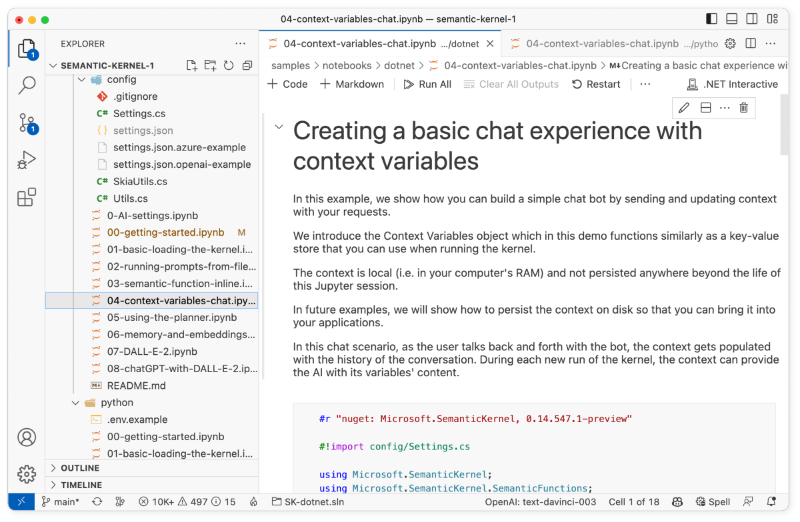

# Creating a basic chat experience with context variables 

The following steps walk through the _04-context-variables-chat.ipynb_ notebook in the `/samples/notebooks` folder. We recommend following along in the notebook so that you can easily run the code snippets by pressing the run button next to each code snippet.

| Language | File | Link |
| --- | --- | --- |
| C# | _/samples/notebooks/dotnet/04-context-variables-chat.ipynb_ | [Open notebook in GitHub](https://github.com/microsoft/semantic-kernel/blob/main/samples/notebooks/dotnet/04-context-variables-chat.ipynb) |
| Python | +/samples/notebooks/python/04-context-variables-chat.ipynb_ | [Open notebook in GitHub](https://github.com/microsoft/semantic-kernel/blob/main/samples/notebooks/python/04-context-variables-chat.ipynb) |





## 1) Load and configure the kernel
In this guide, we'll show how you can build a simple chat bot by sending and updating context with your requests. To begin, load and configure the kernel as usual. The following code snippets use the configuration that was created in the [getting started notebook](./getting-started.md).

# [C#](#tab/Csharp)

```csharp
#r "nuget: Microsoft.SemanticKernel"

#!import config/Settings.cs

using Microsoft.SemanticKernel;

var kernel = KernelBuilder.Create();

// Configure AI backend used by the kernel
var (useAzureOpenAI, model, azureEndpoint, apiKey, orgId) = Settings.LoadFromFile();
if (useAzureOpenAI)
    kernel.Config.AddAzureTextCompletionService(model, azureEndpoint, apiKey);
else
    kernel.Config.AddOpenAITextCompletionService(model, apiKey, orgId);
```

# [Python](#tab/python)

```python
import semantic_kernel as sk
from semantic_kernel.connectors.ai.open_ai import AzureTextCompletion, OpenAITextCompletion

kernel = sk.Kernel()

useAzureOpenAI = False

# Configure AI service used by the kernel
if useAzureOpenAI:
    deployment, api_key, endpoint = sk.azure_openai_settings_from_dot_env()
    kernel.add_text_completion_service("dv", AzureTextCompletion(deployment, endpoint, api_key))
else:
    api_key, org_id = sk.openai_settings_from_dot_env()
    kernel.add_text_completion_service("dv", OpenAITextCompletion("text-davinci-003", api_key, org_id))
```

---


## 2) Create the semantic function for the chat bot
To get the chat bot to respond to our requests, we'll need to create and register a semantic function that can process our requests and return a response. Notice the `{{$history}}` and `{{$userInput}}` variables in the prompt. These variables will be used to pass in the conversation history and the user's input respectively.

# [C#](#tab/Csharp)

```csharp
const string skPrompt = @"
ChatBot can have a conversation with you about any topic.
It can give explicit instructions or say 'I don't know' if it does not have an answer.

{{$history}}
User: {{$userInput}}
ChatBot:";

var promptConfig = new PromptTemplateConfig
{
    Completion =
    {
        MaxTokens = 2000,
        Temperature = 0.7,
        TopP = 0.5,
    }
};

var promptTemplate = new PromptTemplate(skPrompt, promptConfig, kernel);
var functionConfig = new SemanticFunctionConfig(promptConfig, promptTemplate);
var chatFunction = kernel.RegisterSemanticFunction("ChatBot", "Chat", functionConfig);
```


# [Python](#tab/python)

```python
sk_prompt = """
ChatBot can have a conversation with you about any topic.
It can give explicit instructions or say 'I don't know' if it does not have an answer.

{{$history}}
User: {{$user_input}}
ChatBot: """

chat_function = kernel.create_semantic_function(sk_prompt, "ChatBot", max_tokens=2000, temperature=0.7, top_p=0.5)
```

---

## 3) Initialize the context

If we used the semantic function above as is, the chat bot would be able to respond to our requests, but it would not be able to remember the context of the rest of the conversation. To enable the chat bot to remember the context of the conversation, we'll need to use context variables.

Context variables behave like a key-value store you can use while running the kernel. The context stored in the kernel is local (i.e. in your computer's RAM) and not persisted anywhere beyond the life of the program. In future examples, we will show how to persist the context on disk so that you can bring it back up later.

In this example, we'll  initialize the context with a `history` variable. The `history` variable will be used to store the entire conversation history so that the chat bot can use it to know what has been said before.


# [C#](#tab/Csharp)

```csharp
var context = kernel.CreateNewContext();

var history = "";
context["history"] = history;
```


# [Python](#tab/python)

```python
context = kernel.create_new_context()
context["history"] = ""
```

---

## 4) Send the first request to the chat bot
Now that we have initialized the context, we can send the first request to the chat bot and store the response in a variable called `bot_answer`. To set the `userInput` variable in the semantic function, we'll need to set the `userInput` variable in the context.

# [C#](#tab/Csharp)

```csharp
var userInput = "Hi, I'm looking for book suggestions";
context["userInput"] = userInput;

var bot_answer = await chatFunction.InvokeAsync(context);
```

# [Python](#tab/python)

```python
context["user_input"] = "Hi, I'm looking for book suggestions"
bot_answer = await chat_function.invoke_async(context=context)
print(bot_answer)
```

---


## 5) Update the history with the response
We can now update the `history` variable in the context with the response from the chat bot. To do this, we'll append the `userInput` and `bot_answer` variables to the `history` context variable.

# [C#](#tab/Csharp)

```csharp
history += $"\nUser: {userInput}\nMelody: {bot_answer}\n";
context.Variables.Update(history);

Console.WriteLine(context);
```

# [Python](#tab/python)

```python
context["history"] += f"\nUser: {context['user_input']}\nChatBot: {bot_answer}\n"
print(context["history"])
```

---


## 6) Make a function to send requests to the chat bot
To make it easier to send requests to the chat bot, we'll create a function called `Chat` that takes in a string and sends it to the chat bot. The `Chat` function will then update the `history` context variable with the new interaction and print the response from the chat bot.

# [C#](#tab/Csharp)

```csharp
Func<string, Task> Chat = async (string input) => {
    // Save new message in the context variables
    context["userInput"] = input;

    // Process the user message and get an answer
    var answer = await chatFunction.InvokeAsync(context);

    // Append the new interaction to the chat history
    history += $"\nUser: {input}\nMelody: {answer}\n"; 
    context["history"] = history;
    
    // Show the response
    Console.WriteLine(context);
};
```

# [Python](#tab/python)

```python
async def chat(input_text: str) -> None:
    # Save new message in the context variables
    print(f"User: {input_text}")
    context["user_input"] = input_text

    # Process the user message and get an answer
    answer = await chat_function.invoke_async(context=context)

    # Show the response
    print(f"ChatBot: {answer}")

    # Append the new interaction to the chat history
    context["history"] += f"\nUser: {input_text}\nChatBot: {answer}\n"
```

---

## 7) Keep chatting!
You can now chat with the chat bot by calling the `Chat` function with a string. Try it out multiple times and see what happens!


# [C#](#tab/Csharp)

```csharp
await Chat("I would like a non-fiction book suggestion about Greece history. Please only list one book.");
```

# [Python](#tab/python)

```python
await chat("I love history and philosophy, I'd like to learn something new about Greece, any suggestion?")
```

---


## Next steps
Now that you know how to set additional context variables, you can now move on to the next step in the [quick start guide](index.md) to learn how to use planner to dynamically create prompt chains.

| File | Link | Description |
| --- | --- | --- |
| _00-getting-started.ipynb_| [Open guide](./getting-started.md)| Run your first prompt  |
| _01-basic-loading-the-kernel.ipynb_ | [Open guide](./loading-the-kernel.md) | Changing the configuration of the kernel |
| _02-running-prompts-from-file.ipynb_ | [Open guide](./running-prompts-from-files.md) | Learn how to run prompts from a file |
| _03-semantic-function-inline.ipynb_ | [Open guide](./semantic-function-inline.md) | Configure and run prompts directly in code | 
| _04-context-variables-chat.ipynb_ |**You are here**  | Use variables to make prompts dynamic |
| _05-using-the-planner.ipynb_ | [Open guide](./using-the-planner.md) | Dynamically create prompt chains with planner |
| _06-memory-and-embeddings.ipynb_ | [Open guide](./memory-and-embeddings.md) | Store and retrieve memory with embeddings |


> [!div class="nextstepaction"]
> [Use planner](./using-the-planner.md)

