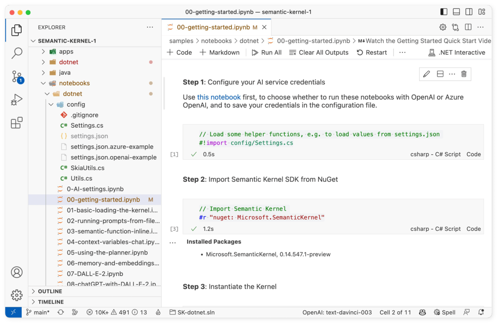

# Getting started 

The following steps walk through the _00-getting-started.ipynb_ notebook in the `/dotnet/notebooks` or `/python/notebooks` folder. We recommend following along in the notebook so that you can easily run the code snippets by pressing the run button next to each code snippet.





| Language | File | Link |
| --- | --- | --- |
| C# | _/dotnet/notebooks/00-getting-started.ipynb_ | [Open notebook in GitHub](https://github.com/microsoft/semantic-kernel/blob/main/dotnet/notebooks/00-getting-started.ipynb) |
| Python | _/python/notebooks/00-getting-started.ipynb_ | [Open notebook in GitHub](https://github.com/microsoft/semantic-kernel/blob/main/python/notebooks/00-getting-started.ipynb) |


## 1) Import the SDK
You first need to import the Semantic Kernel SDK so that you can use it. The following code snippets show how to import the SDK in either C# or Python.

# [C#](#tab/Csharp)

```csharp
// Import Semantic Kernel
#r "nuget: Microsoft.SemanticKernel"
```

# [Python](#tab/python)

```python
!python -m pip install semantic-kernel
```

---

## 2) Instantiate the kernel
Next, you need to instantiate the kernel. The kernel is the main object that you will use to interact with the Semantic Kernel SDK to orchestrate plugins.

# [C#](#tab/Csharp)

```csharp
using Microsoft.SemanticKernel;

// Set Simple kernel instance
IKernel kernel = KernelBuilder.Create();
```

# [Python](#tab/python)

```python
import semantic_kernel as sk

kernel = sk.Kernel()
```

---

## 3) Prepare your AI service endpoint settings
Next, you need to configure your AI service endpoint settings for the kernel. The required settings depend on whether you're using OpenAI or Azure OpenAI.

# [C#](#tab/Csharp)

For C# users, you can configure your AI service endpoint by running the `0-AI-settings.ipynb` notebook. Once you are done, you can run the following cell in the notebook to load your settings.

```csharp
// Load some helper functions, e.g. to load values from settings.json
#!import config/Settings.cs
```

```csharp
// Configure AI service credentials used by the kernel
var (useAzureOpenAI, model, azureEndpoint, apiKey, orgId) = Settings.LoadFromFile();

if (useAzureOpenAI)
    kernel.Config.AddAzureTextCompletionService(model, azureEndpoint, apiKey);
else
    kernel.Config.AddOpenAITextCompletionService(model, apiKey, orgId);
```

# [Python](#tab/python)

If you are using OpenAI as your service, add your [OpenAI Key](https://openai.com/api/) to a `.env` file in the `/python/notebooks` folder. Optionally include the org Id if you have multiple orgs. There is a `.env.example` file in the folder that you can use as a template.

```.env
OPENAI_API_KEY="sk-..."
OPENAI_ORG_ID=""
```

If, however, you are using Azure OpenAI instead, you wil need to populate the following values in the `.env` file in the `/python/notebooks` folder. There is a `.env.example` file in the folder that you can use as a template.

```.env
AZURE_OPENAI_DEPLOYMENT_NAME=""
AZURE_OPENAI_ENDPOINT=""
AZURE_OPENAI_API_KEY=""
```

---

## 4) Configure your AI endpoint using your settings
Once you have created your settings, you can configure the kernel to use your AI service endpoint.
# [C#](#tab/Csharp)

```csharp
// Configure AI service credentials used by the kernel
var (useAzureOpenAI, model, azureEndpoint, apiKey, orgId) = Settings.LoadFromFile();

if (useAzureOpenAI)
    kernel.Config.AddAzureTextCompletionService(model, azureEndpoint, apiKey);
else
    kernel.Config.AddOpenAITextCompletionService(model, apiKey, orgId);
```

# [Python](#tab/python)

If you are using OpenAI, run the following cell in the notebook to load your OpenAI settings.

```python
from semantic_kernel.connectors.ai.open_ai import OpenAITextCompletion

api_key, org_id = sk.openai_settings_from_dot_env()

kernel.add_text_completion_service("dv", OpenAITextCompletion("text-davinci-003", api_key, org_id))
```


If you are using Azure OpenAI instead, run the following cell in the notebook to load your Azure OpenAI settings.

```python
from semantic_kernel.connectors.ai.open_ai import AzureTextCompletion

deployment, api_key, endpoint = sk.azure_openai_settings_from_dot_env()

kernel.add_text_completion_service("dv", AzureTextCompletion(deployment, endpoint, api_key))
```

---

## 5) Load and run your first plugin
Finally, you can load and run your first plugin. The following code snippets show how to load and run the `FunSkill` plugin from the `/skills` folder so that you can run the `Joke` function.

# [C#](#tab/Csharp)

```csharp
// Load the Plugins Directory
var skillsDirectory = Path.Combine(System.IO.Directory.GetCurrentDirectory(), "..", "..", "skills");

// Load the FunSkill from the Plugins Directory
var funSkillFunctions = kernel.ImportSemanticSkillFromDirectory(skillsDirectory, "FunSkill");

// Run the Function called Joke
var result = await funSkillFunctions["Joke"].InvokeAsync("time travel to dinosaur age");

// Return the result to the Notebook
Console.WriteLine(result);
```

# [Python](#tab/python)

```python
skill = kernel.import_semantic_skill_from_directory("../../skills", "FunSkill")
joke_function = skill["Joke"]

print(joke_function("time travel to dinosaur age"))
```

---

When you run the above code, the kernel will use the provided input (i.e., `time travel to dinosaur age`) to populate, or "render," the prompt template in the `Joke`  function. Below is the prompt template that is used to generate the rendered prompt.

```skprompt.txt
WRITE EXACTLY ONE JOKE or HUMOROUS STORY ABOUT THE TOPIC BELOW

JOKE MUST BE:
- G RATED
- WORKPLACE/FAMILY SAFE
NO SEXISM, RACISM OR OTHER BIAS/BIGOTRY

BE CREATIVE AND FUNNY. I WANT TO LAUGH.
{{$style}}
+++++

{{$input}}
+++++
```

Below is the rendered prompt that is generated using the above template and input.

```output
WRITE EXACTLY ONE JOKE or HUMOROUS STORY ABOUT THE TOPIC BELOW

JOKE MUST BE:
- G RATED
- WORKPLACE/FAMILY SAFE
NO SEXISM, RACISM OR OTHER BIAS/BIGOTRY

BE CREATIVE AND FUNNY. I WANT TO LAUGH.
{{$style}}
+++++

time travel to dinosaur age
+++++
```

This rendered prompt is then sent to the AI service where it is used to generate the joke. The following is an example of a joke that was generated using the above prompt.

```output
A time traveler went back to the dinosaur age and was amazed by the size of the creatures. He asked one of the dinosaurs, "How do you manage to get around with such short legs?"

The dinosaur replied, "It's easy, I just take my time!"
```

## Next steps

Congrats! If you have gotten this far, you have successfully configured the kernel and run your first prompt. You can now move on to the next step in the [quick start guide](index.md) to learn how to change the configuration of the kernel.

| File | Link | Description |
| --- | --- | --- |
| _00-getting-started.ipynb_| **You are here** | Run your first prompt  |
| _01-basic-loading-the-kernel.ipynb_ | [Open guide](./loading-the-kernel.md) | Changing the configuration of the kernel |
| _02-running-prompts-from-file.ipynb_ |  [Open guide](./running-prompts-from-files.md) | Learn how to run prompts from a file |
| _03-semantic-function-inline.ipynb_ | [Open guide](./semantic-function-inline.md) | Configure and run prompts directly in code | 
| _04-context-variables-chat.ipynb_ | [Open guide](./context-variables-chat.md) | Use variables to make prompts dynamic |
| _05-using-the-planner.ipynb_ | [Open guide](./using-the-planner.md) | Dynamically create prompt chains with planner |
| _06-memory-and-embeddings.ipynb_ | [Open guide](./memory-and-embeddings.md) | Store and retrieve memory with embeddings |


> [!div class="nextstepaction"]
> [Load the kernel](./loading-the-kernel.md)
