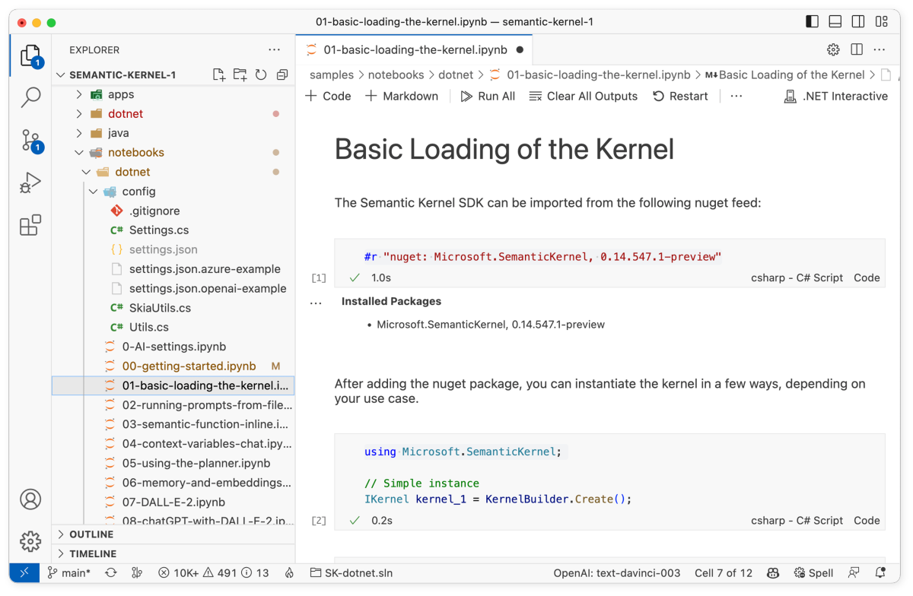

# Loading the kernel 

The following steps walk through the _01-basic-loading-the-kernel.ipynb_ notebook in the `/samples/notebooks` folder. We recommend following along in the notebook so that you can easily run the code snippets by pressing the run button next to each code snippet.

| Language | File | Link |
| --- | --- | --- |
| C# | _/samples/notebooks/dotnet/01-basic-loading-the-kernel.ipynb_ | [Open notebook in GitHub](https://github.com/microsoft/semantic-kernel/blob/main/samples/notebooks/dotnet/01-basic-loading-the-kernel.ipynb) |
| Python | _/samples/notebooks/python/01-basic-loading-the-kernel.ipynb_ | [Open notebook in GitHub](https://github.com/microsoft/semantic-kernel/blob/main/samples/notebooks/python/01-basic-loading-the-kernel.ipynb) |





## 1) Import the SDK
You first need to import the Semantic Kernel SDK so that you can use it. The following code snippets show how to import the SDK in either C# or Python.

# [C#](#tab/Csharp)

```csharp
// Import Semantic Kernel
#r "nuget: Microsoft.SemanticKernel"
```

# [Python](#tab/python)

```python
import semantic_kernel as sk
from semantic_kernel.connectors.ai.open_ai import AzureTextCompletion, OpenAITextCompletion
```

---


## 2) Instantiate the kernel
There are several different ways to instantiate the kernel depending on your needs. Below are the different ways to instantiate the kernel depending on the language you are using.

# [C#](#tab/Csharp)

If you want to use the default configuration, you can instantiate the kernel using the `KernelBuilder.Create()` method.


```csharp
using Microsoft.SemanticKernel;

// Simple instance
IKernel kernel_1 = KernelBuilder.Create();
```

Alternatively, you can use the `KernelBuilder` to create a kernel with custom configuration. The following code snippet shows how to create a kernel with a logger.

```csharp
using Microsoft.Extensions.Logging;
using Microsoft.Extensions.Logging.Abstractions;

// Inject your logger 
// see Microsoft.Extensions.Logging.ILogger @ https://learn.microsoft.com/dotnet/core/extensions/logging
ILogger myLogger = NullLogger.Instance;
IKernel kernel_2 = Kernel.Builder
    .WithLogger(myLogger)
    .Build();
```

Lastly, you can create a kernel using a configuration object. This is useful if you want to define a configuration elsewhere in your code and then inject it into the kernel.

```csharp
// Inject a custom configuration
var config = new KernelConfig();
IKernel kernel_3 = Kernel.Builder
    .WithConfiguration(config)
    .Build();
```

# [Python](#tab/python)

If you want to use the default configuration, you can instantiate the kernel using the `Kernel()` method.

```python
# Simple instance
kernel_1 = sk.Kernel()
```

Alternatively, you can pass in custom configuration into the  `Kernel()` method to create a kernel with custom settings. The following code snippet shows how to create a kernel with a logger.

```python
# Instance with a custom logger
my_logger = sk.NullLogger()
kernel_2 = sk.Kernel(log=my_logger)
```

---

## 3) Add AI models to the kernel
When using the kernel to make AI requests, you need to add AI models and their configuration to the kernel. The code snippets below use OpenAI models as an example; if you need an Azure OpenAI key, please go [here](/azure/cognitive-services/openai/quickstart?pivots=rest-api).

# [C#](#tab/Csharp)
In C# you can add AI models to the kernel using the `AddAzureTextCompletionService` or `AddOpenAITextCompletionService` methods depending on which AI service you want to use.

```csharp
IKernel kernel = KernelBuilder.Create();

kernel.Config.AddAzureTextCompletionService(
    "my-finetuned-Curie",                   // Azure OpenAI *Deployment ID*
    "https://contoso.openai.azure.com/",    // Azure OpenAI *Endpoint*
    "...your Azure OpenAI Key...",          // Azure OpenAI *Key*
    "Azure_curie"                           // alias used in the prompt templates' config.json
);

kernel.Config.AddOpenAITextCompletionService(
    "text-davinci-003",                     // OpenAI Model Name
    "...your OpenAI API Key...",            // OpenAI API key
    "...your OpenAI Org ID...",             // *optional* OpenAI Organization ID
    "OpenAI_davinci"                        // alias used in the prompt templates' config.json
);
```

# [Python](#tab/python)
To add AI models to the kernel in Python, you can use the `add_text_completion_service` method. Depending on which AI service you want to use, you can either use the `AzureTextCompletion` or `OpenAITextCompletion` classes.

```python
kernel = sk.Kernel()

kernel.add_text_completion_service(               # We are adding a text service
    "Azure_curie",                            # The alias we can use in prompt templates' config.json
    AzureTextCompletion(
        "my-finetuned-Curie",                 # Azure OpenAI *Deployment ID*
        "https://contoso.openai.azure.com/",  # Azure OpenAI *Endpoint*
        "...your Azure OpenAI Key..."         # Azure OpenAI *Key*
    )
)

kernel.add_text_completion_service(               # We are adding a text service
    "OpenAI_davinci",                         # The alias we can use in prompt templates' config.json
    OpenAITextCompletion(
        "text-davinci-003",                   # OpenAI Model Name
        "...your OpenAI API Key...",          # OpenAI API key
        "...your OpenAI Org ID..."            # *optional* OpenAI Organization ID
    )
)
```

---

## 4) Setting the default AI service
When working with multiple services and multiple models, the first service defined is also the default used whenever a prompt configuration doesn't specify which AI service to use or when a prompt configuration requires a service that is unknown to the kernel

The default can be set and changed programmatically using the following code.

# [C#](#tab/Csharp)

```csharp
kernel.Config.SetDefaultTextCompletionService("Azure_curie");
```

# [Python](#tab/python)

```python
kernel.set_default_text_completion_service("Azure_curie")
```

---


## Next steps

Congrats! If you have gotten this far, you now know all of the different ways to configure the kernel. You can now move on to the next step in the [quick start guide](index.md) to learn how to run prompts from files.

| File | Link | Description |
| --- | --- | --- |
| _00-getting-started.ipynb_| [Open guide](./getting-started.md)| Run your first prompt  |
| _01-basic-loading-the-kernel.ipynb_ | **You are here** | Changing the configuration of the kernel |
| _02-running-prompts-from-file.ipynb_ |  [Open guide](./running-prompts-from-files.md) | Learn how to run prompts from a file |
| _03-semantic-function-inline.ipynb_ | [Open guide](./semantic-function-inline.md) | Configure and run prompts directly in code | 
| _04-context-variables-chat.ipynb_ | [Open guide](./context-variables-chat.md) | Use variables to make prompts dynamic |
| _05-using-the-planner.ipynb_ | [Open guide](./using-the-planner.md) | Dynamically create prompt chains with planner |
| _06-memory-and-embeddings.ipynb_ | [Open guide](./memory-and-embeddings.md) | Store and retrieve memory with embeddings |


> [!div class="nextstepaction"]
> [Run prompts from files](./running-prompts-from-files.md)

