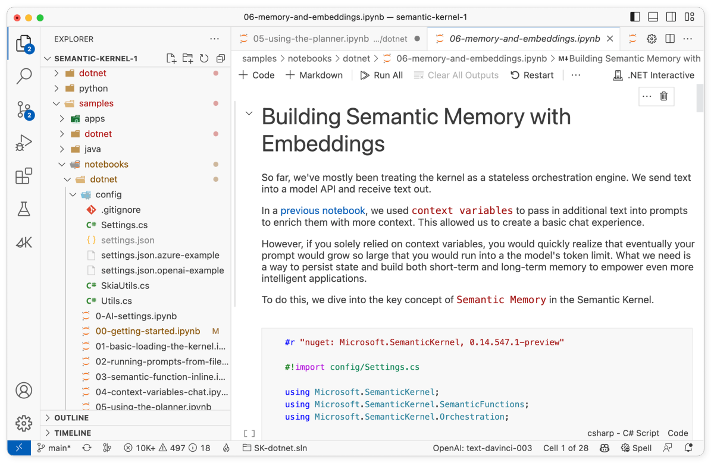

# Building semantic memory with embeddings

The following steps walk through the _06-memory-and-embeddings.ipynb_ notebook in the `/dotnet/notebooks` or `/python/notebooks` folder. We recommend following along in the notebook so that you can easily run the code snippets by pressing the run button next to each code snippet.

| Language | File | Link |
| --- | --- | --- |
| C# | _/dotnet/notebooks/06-memory-and-embeddings.ipynb_ | [Open notebook in GitHub](https://github.com/microsoft/semantic-kernel/blob/main/dotnet/notebooks/06-memory-and-embeddings.ipynb) |
| Python | _/python/notebooks/06-memory-and-embeddings.ipynb_ | [Open notebook in GitHub](https://github.com/microsoft/semantic-kernel/blob/main/python/notebooks/06-memory-and-embeddings.ipynb) |





## 1) Import the SDK
So far, we've mostly treated the kernel as a stateless orchestration engine to send text into a model and receive text out.

In a [previous guide](./context-variables-chat.md), we used context variables to pass in additional text into prompts to enrich them with more context. This allowed us to create a basic chat experience.

However, if you solely relied on context variables, you would quickly realize that eventually your prompt would grow so large that you would run into a the model's token limit. What we need is a way to persist state and build both short-term and long-term memory to empower even more intelligent applications.

To do this, we can leverage semantic memories in the Semantic Kernel. To get started, we will import the necessary packages.

# [C#](#tab/Csharp)

In C# we will add `Microsoft.SemanticKernel.Memory` to our list of imports to access the memory functions.

```csharp
#r "nuget: Microsoft.SemanticKernel"

#!import config/Settings.cs

using Microsoft.SemanticKernel;
using Microsoft.SemanticKernel.SemanticFunctions;
using Microsoft.SemanticKernel.Orchestration;
using Microsoft.SemanticKernel.Memory;
```

# [Python](#tab/python)

In Python we will add `OpenAITextEmbedding` to our list of imports to access the memory functions.

```python
from typing import Tuple

import semantic_kernel as sk
from semantic_kernel.connectors.ai.open_ai import OpenAITextCompletion, OpenAITextEmbedding
```

---


## 2) Instantiate the kernel with memory
At its core, semantic memory is a set of data structures that allow you to store the meaning of text that comes from different data sources, and optionally to store the source text too. These texts can be from the web, e-mail providers, chats, a database, or from your local directory, and are hooked up to the Semantic Kernel through data source connectors.

In order to use memory in our example, we'll first instantiate the kernel with memory storage and an embedding service. In this example, we make use of the `VolatileMemoryStore` which can be thought of as a temporary in-memory storage (not to be confused with Semantic Memory). This memory is not written to disk and is only available during the app session. When developing your app you will have the option to plug in persistent storage like Azure Cognitive Search, PostgreSQL, SQLite, etc.

# [C#](#tab/Csharp)

```csharp
var (useAzureOpenAI, model, azureEndpoint, apiKey, orgId) = Settings.LoadFromFile();

var kernel = new KernelBuilder()
    .Configure(c =>
    {
        if (useAzureOpenAI)
        {
            c.AddAzureTextEmbeddingGenerationService("text-embedding-ada-002", azureEndpoint, apiKey);
            c.AddAzureTextCompletionService(model, azureEndpoint, apiKey);
        }
        else
        {
            c.AddOpenAITextEmbeddingGenerationService("text-embedding-ada-002", apiKey);
            c.AddOpenAITextCompletionService(model, apiKey, orgId);
        }
    })
    .WithMemoryStorage(new VolatileMemoryStore())
    .Build();
```


# [Python](#tab/python)

```python
kernel = sk.Kernel()

api_key, org_id = sk.openai_settings_from_dot_env()
kernel.add_text_completion_service("dv", OpenAITextCompletion("text-davinci-003", api_key, org_id))
kernel.add_text_embedding_generation_service("ada", OpenAITextEmbedding("text-embedding-ada-002", api_key, org_id))

kernel.register_memory_store(memory_store=sk.memory.VolatileMemoryStore())
kernel.import_skill(sk.core_skills.TextMemorySkill())
```

---

## 3) Manually adding memories
Let's start by adding some memories manually to the `VolatileMemoryStore`. In this example, we'll add some information about a person named Andrea so that we can later query the memory to retrieve this information.

# [C#](#tab/Csharp)
In C# we'll use the `SaveInformationAsync` method to save information to the memory. This method takes in a collection name, an id, and the text to save.

```csharp
const string MemoryCollectionName = "aboutMe";

await kernel.Memory.SaveInformationAsync(MemoryCollectionName, id: "info1", text: "My name is Andrea");
await kernel.Memory.SaveInformationAsync(MemoryCollectionName, id: "info2", text: "I currently work as a tourist operator");
await kernel.Memory.SaveInformationAsync(MemoryCollectionName, id: "info3", text: "I currently live in Seattle and have been living there since 2005");
await kernel.Memory.SaveInformationAsync(MemoryCollectionName, id: "info4", text: "I visited France and Italy five times since 2015");
await kernel.Memory.SaveInformationAsync(MemoryCollectionName, id: "info5", text: "My family is from New York");
```

# [Python](#tab/python)
In Python we'll use the `save_information_async` method to save information to the memory. This method takes in a collection name, an id, and the text to save.

```python
async def populate_memory(kernel: sk.Kernel) -> None:
    # Add some documents to the semantic memory
    await kernel.memory.save_information_async(
        "aboutMe", id="info1", text="My name is Andrea"
    )
    await kernel.memory.save_information_async(
        "aboutMe", id="info2", text="I currently work as a tour guide"
    )
    await kernel.memory.save_information_async(
        "aboutMe", id="info3", text="I've been living in Seattle since 2005"
    )
    await kernel.memory.save_information_async(
        "aboutMe", id="info4", text="I visited France and Italy five times since 2015"
    )
    await kernel.memory.save_information_async(
        "aboutMe", id="info5", text="My family is from New York"
    )
```

---

## 4) Searching memories
Now that we have some information in our memory, let's search for it. In this example, we'll search for the information we just added to the memory using questions as our search queries.

# [C#](#tab/Csharp)

```csharp
var questions = new[]
{
    "what is my name?",
    "where do I live?",
    "where is my family from?",
    "where have I traveled?",
    "what do I do for work?",
};

foreach (var q in questions)
{
    var response = await kernel.Memory.SearchAsync(MemoryCollectionName, q).FirstOrDefaultAsync();
    Console.WriteLine(q + " " + response?.Metadata.Text);
}
```

# [Python](#tab/python)

```python
async def search_memory_examples(kernel: sk.Kernel) -> None:
    questions = [
        "what's my name",
        "where do I live?",
        "where's my family from?",
        "where have I traveled?",
        "what do I do for work",
    ]

    for question in questions:
        print(f"Question: {question}")
        result = await kernel.memory.search_async("aboutMe", question)
        print(f"Answer: {result[0].text}\n")
```

---

After running the code above, you should see the following output.

```output
what is my name? My name is Andrea
where do I live? I currently live in Seattle and have been living there since 2005
where is my family from? My family is from New York
where have I traveled? I visited France and Italy five times since 2015
what do I do for work? I currently work as a tourist operator
```


## 5) Adding memories to our agent
Let's now revisit our chat sample from the [previous notebook](./context-variables-chat.md). If you remember, we used context variables to fill the prompt with a `history` variable that continuously got populated as we chatted with the agent. Let's improve our agent by adding memory to it!

We will achieve this by using the `TextMemorySkill` plugin which exposes the `recall` native function. The `recall` function takes an input ask and performs a similarity search on the contents that have been previously embedded in the memory Store. By default, `recall` returns the most relevant memory.


# [C#](#tab/Csharp)

```csharp
using Microsoft.SemanticKernel.CoreSkills;

// TextMemorySkill provides the "recall" function
kernel.ImportSkill(new TextMemorySkill());

const string skPrompt = @"
ChatBot can have a conversation with you about any topic.
It can give explicit instructions or say 'I don't know' if it does not have an answer.

Information about me, from previous conversations:
- {{$fact1}} {{recall $fact1}}
- {{$fact2}} {{recall $fact2}}
- {{$fact3}} {{recall $fact3}}
- {{$fact4}} {{recall $fact4}}
- {{$fact5}} {{recall $fact5}}

Chat:
{{$history}}
User: {{$userInput}}
ChatBot: ";

var chatFunction = kernel.CreateSemanticFunction(skPrompt, maxTokens: 200, temperature: 0.8);

var context = kernel.CreateNewContext();

context["fact1"] = "what is my name?";
context["fact2"] = "where do I live?";
context["fact3"] = "where is my family from?";
context["fact4"] = "where have I travelled?";
context["fact5"] = "what do I do for work?";

context[TextMemorySkill.CollectionParam] = MemoryCollectionName;
context[TextMemorySkill.RelevanceParam] = "0.8";
```


# [Python](#tab/python)

```python
async def setup_chat_with_memory(
    kernel: sk.Kernel,
) -> Tuple[sk.SKFunctionBase, sk.SKContext]:
    sk_prompt = """
    ChatBot can have a conversation with you about any topic.
    It can give explicit instructions or say 'I don't know' if
    it does not have an answer.

    Information about me, from previous conversations:
    - {{$fact1}} {{recall $fact1}}
    - {{$fact2}} {{recall $fact2}}
    - {{$fact3}} {{recall $fact3}}
    - {{$fact4}} {{recall $fact4}}
    - {{$fact5}} {{recall $fact5}}

    Chat:
    {{$chat_history}}
    User: {{$user_input}}
    ChatBot: """.strip()

    chat_func = kernel.create_semantic_function(sk_prompt, max_tokens=200, temperature=0.8)

    context = kernel.create_new_context()
    context["fact1"] = "what is my name?"
    context["fact2"] = "where do I live?"
    context["fact3"] = "where's my family from?"
    context["fact4"] = "where have I traveled?"
    context["fact5"] = "what do I do for work?"

    context[sk.core_skills.TextMemorySkill.COLLECTION_PARAM] = "aboutMe"
    context[sk.core_skills.TextMemorySkill.RELEVANCE_PARAM] = 0.8

    context["chat_history"] = ""

    return chat_func, context
```

---

The `RelevanceParam` is used in memory search and is a measure of the relevance score from 0.0 to 1.0, where 1.0 means a perfect match. We encourage users to experiment with different values to see what works best for their use case.


## 5) Chatting with our chatbot
Let's say that we want to add an additional step to the plan that rewrites the e-mail in the style of Shakespeare. To do so, we'll need to create a function that takes in the e-mail text and rewrites it in the style of Shakespeare. We'll then add the function to the kernel and re-run planner with a new ask to see the updated plan.

# [C#](#tab/Csharp)

```csharp
var history = "";
context["history"] = history;
Func<string, Task> Chat = async (string input) => {
    // Save new message in the context variables
    context["userInput"] = input;

    // Process the user message and get an answer
    var answer = await chatFunction.InvokeAsync(context);

    // Append the new interaction to the chat history
    history += $"\nUser: {input}\nChatBot: {answer}\n";
    context["history"] = history;

    // Show the bot response
    Console.WriteLine("ChatBot: " + context);
};
```

```csharp
await Chat("Hello, I think we've met before, remember? my name is...");
await Chat("I want to plan a trip and visit my family. Do you know where that is?");
await Chat("Great! What are some fun things to do there?");
```


# [Python](#tab/python)

```python
async def chat(
    kernel: sk.Kernel, chat_func: sk.SKFunctionBase, context: sk.SKContext
) -> bool:
    try:
        user_input = input("User:> ")
        context["user_input"] = user_input
        print(f"User:> {user_input}")
    except KeyboardInterrupt:
        print("\n\nExiting chat...")
        return False
    except EOFError:
        print("\n\nExiting chat...")
        return False

    if user_input == "exit":
        print("\n\nExiting chat...")
        return False

    answer = await kernel.run_async(chat_func, input_vars=context.variables)
    context["chat_history"] += f"\nUser:> {user_input}\nChatBot:> {answer}\n"

    print(f"ChatBot:> {answer}")
    return True
```

```python
print("Populating memory...")
await populate_memory(kernel)

print("Asking questions... (manually)")
await search_memory_examples(kernel)

print("Setting up a chat (with memory!)")
chat_func, context = await setup_chat_with_memory(kernel)

print("Begin chatting (type 'exit' to exit):\n")
chatting = True
while chatting:
    chatting = await chat(kernel, chat_func, context)
```

---

Whenever you run the chat function, the agent should be able to successfully recall the personal information about Andrea that we stored in the memory collection.


## 6) Adding documents to memory
Many times in your applications you'll want to bring in external documents into your memory. Let's see how we can do this using our VolatileMemoryStore. In this example, we'll collect data using some of the links in the Semantic Kernel repo.

# [C#](#tab/Csharp)

```csharp
const string memoryCollectionName = "SKGitHub";

var githubFiles = new Dictionary<string, string>()
{
    ["https://github.com/microsoft/semantic-kernel/blob/main/README.md"]
        = "README: Installation, getting started, and how to contribute",
    ["https://github.com/microsoft/semantic-kernel/blob/main/dotnet/notebooks/02-running-prompts-from-file.ipynb"]
        = "Jupyter notebook describing how to pass prompts from a file to a semantic skill or function",
    ["https://github.com/microsoft/semantic-kernel/blob/main/dotnet/notebooks/00-getting-started.ipynb"]
        = "Jupyter notebook describing how to get started with the Semantic Kernel",
    ["https://github.com/microsoft/semantic-kernel/tree/main/samples/skills/ChatSkill/ChatGPT"]
        = "Sample demonstrating how to create a chat skill interfacing with ChatGPT",
    ["https://github.com/microsoft/semantic-kernel/blob/main/dotnet/src/SemanticKernel/Memory/Volatile/VolatileMemoryStore.cs"]
        = "C# class that defines a volatile embedding store",
    ["https://github.com/microsoft/semantic-kernel/tree/main/samples/dotnet/KernelHttpServer/README.md"]
        = "README: How to set up a Semantic Kernel Service API using Azure Function Runtime v4",
    ["https://github.com/microsoft/semantic-kernel/tree/main/samples/apps/chat-summary-webapp-react/README.md"]
        = "README: README associated with a sample starter react-based chat summary webapp",
};
```

Let's rebuild our kernel with the new memory collection.

```csharp
var kernel = Microsoft.SemanticKernel.Kernel.Builder
    .Configure(c =>
    {
        if (useAzureOpenAI)
        {
            c.AddAzureTextEmbeddingGenerationService("text-embedding-ada-002", azureEndpoint, apiKey);
            c.AddAzureTextCompletionService(model, azureEndpoint, apiKey);
        }
        else
        {
            c.AddOpenAITextEmbeddingGenerationService("text-embedding-ada-002", apiKey);
            c.AddOpenAITextCompletionService(model, apiKey, orgId);
        }
    })
    .WithMemoryStorage(new VolatileMemoryStore())
    .Build();
```

Now let's add these files to our VolatileMemoryStore using `SaveReferenceAsync`.

```csharp
Console.WriteLine("Adding some GitHub file URLs and their descriptions to a volatile Semantic Memory.");
var i = 0;
foreach (var entry in githubFiles)
{
    await kernel.Memory.SaveReferenceAsync(
        collection: memoryCollectionName,
        description: entry.Value,
        text: entry.Value,
        externalId: entry.Key,
        externalSourceName: "GitHub"
    );
    Console.WriteLine($"  URL {++i} saved");
}

string ask = "I love Jupyter notebooks, how should I get started?";
Console.WriteLine("===========================\n" +
                    "Query: " + ask + "\n");

var memories = kernel.Memory.SearchAsync(memoryCollectionName, ask, limit: 5, minRelevanceScore: 0.77);

i = 0;
await foreach (MemoryQueryResult memory in memories)
{
    Console.WriteLine($"Result {++i}:");
    Console.WriteLine("  URL:     : " + memory.Metadata.Id);
    Console.WriteLine("  Title    : " + memory.Metadata.Description);
    Console.WriteLine("  Relevance: " + memory.Relevance);
    Console.WriteLine();
}
```


# [Python](#tab/python)

```python
github_files ={}
github_files["https://github.com/microsoft/semantic-kernel/blob/main/README.md"] = \
    "README: Installation, getting started, and how to contribute"
github_files["https://github.com/microsoft/semantic-kernel/blob/main/dotnet/notebooks/02-running-prompts-from-file.ipynb"] = \
    "Jupyter notebook describing how to pass prompts from a file to a semantic skill or function"
github_files["https://github.com/microsoft/semantic-kernel/blob/main/dotnet/notebooks/00-getting-started.ipynb"] = \
    "Jupyter notebook describing how to get started with the Semantic Kernel"
github_files["https://github.com/microsoft/semantic-kernel/tree/main/samples/skills/ChatSkill/ChatGPT"] = \
    "Sample demonstrating how to create a chat skill interfacing with ChatGPT"
github_files["https://github.com/microsoft/semantic-kernel/blob/main/dotnet/src/SemanticKernel/Memory/Volatile/VolatileMemoryStore.cs"] = \
    "C# class that defines a volatile embedding store"
github_files["https://github.com/microsoft/semantic-kernel/tree/main/samples/dotnet/KernelHttpServer/README.md"] = \
    "README: How to set up a Semantic Kernel Service API using Azure Function Runtime v4"
github_files["https://github.com/microsoft/semantic-kernel/tree/main/samples/apps/chat-summary-webapp-react/README.md"] = \
    "README: README associated with a sample starter react-based chat summary webapp"
```

Now let's add these files to our VolatileMemoryStore using `SaveReferenceAsync`. We'll separate these memories from the chat memories by putting them in a different collection.

```python
memory_collection_name = "SKGitHub"
print("Adding some GitHub file URLs and their descriptions to a volatile Semantic Memory.");
i = 0
for entry, value in github_files.items():
    await kernel.memory.save_reference_async(
        collection=memory_collection_name,
        description=value,
        text=value,
        external_id=entry,
        external_source_name="GitHub"
    )
    i += 1
    print("  URL {} saved".format(i))

ask = "I love Jupyter notebooks, how should I get started?"
print("===========================\n" + "Query: " + ask + "\n")

memories = await kernel.memory.search_async(memory_collection_name, ask, limit=5, min_relevance_score=0.77)

i = 0
for memory in memories:
    i += 1
    print(f"Result {i}:")
    print("  URL:     : " + memory.id)
    print("  Title    : " + memory.description)
    print("  Relevance: " + str(memory.relevance))
    print()
```

---

After running the code above, you should see an output that looks something like this. Notice how it was able to find the GitHub READMEs that were added to the memory store and rank them based on relevance.

```output
===========================
Query: I love Jupyter notebooks, how should I get started?

Result 1:
  URL:     : https://github.com/microsoft/semantic-kernel/blob/main/dotnet/notebooks/00-getting-started.ipynb
  Title    : Jupyter notebook describing how to get started with the Semantic Kernel
  Relevance: 0.8676699896124279

Result 2:
  URL:     : https://github.com/microsoft/semantic-kernel/blob/main/dotnet/notebooks/02-running-prompts-from-file.ipynb
  Title    : Jupyter notebook describing how to pass prompts from a file to a semantic skill or function
  Relevance: 0.8163699804499914

Result 3:
  URL:     : https://github.com/microsoft/semantic-kernel/blob/main/README.md
  Title    : README: Installation, getting started, and how to contribute
  Relevance: 0.808323849821138
```


## Next steps
Congrats! You've now completed the quick start guide for the Semantic Kernel. You can now start building your own skills and functions. If you're interested in learning more about the Semantic Kernel, check out the in-depth [Semantic Kernel tutorials](../tutorials.md) or [samples](../../samples-and-solutions/index.md).

| File | Link | Description |
| --- | --- | --- |
| _00-getting-started.ipynb_| [Open guide](./getting-started.md)| Run your first prompt  |
| _01-basic-loading-the-kernel.ipynb_ | [Open guide](./loading-the-kernel.md) | Changing the configuration of the kernel |
| _02-running-prompts-from-file.ipynb_ | [Open guide](./running-prompts-from-files.md) | Learn how to run prompts from a file |
| _03-semantic-function-inline.ipynb_ | [Open guide](./semantic-function-inline.md) | Configure and run prompts directly in code |
| _04-context-variables-chat.ipynb_ | [Open guide](./context-variables-chat.md) | Use variables to make prompts dynamic |
| _05-using-the-planner.ipynb_ | [Open guide](./using-the-planner.md) | Dynamically create prompt chains with planner |
| _06-memory-and-embeddings.ipynb_ | **You are here**  | Store and retrieve memory with embeddings |


> [!div class="nextstepaction"]
> [Find more tutorials](../tutorials.md)

