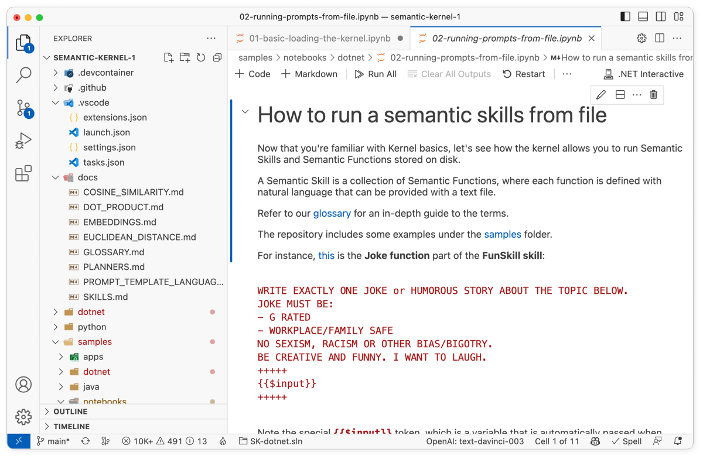

# Running prompts from files 

The following steps walk through the _02-running-prompts-from-file.ipynb_ notebook in the `/dotnet/notebooks` or `/python/notebooks` folder. We recommend following along in the notebook so that you can easily run the code snippets by pressing the run button next to each code snippet.

| Language | File | Link |
| --- | --- | --- |
| C# | _/dotnet/notebooks/02-running-prompts-from-file.ipynb_ | [Open notebook in GitHub](https://github.com/microsoft/semantic-kernel/blob/main/dotnet/notebooks/02-running-prompts-from-file.ipynb) |
| Python | _/python/notebooks/02-running-prompts-from-file.ipynb_ | [Open notebook in GitHub](https://github.com/microsoft/semantic-kernel/blob/main/python/notebooks/02-running-prompts-from-file.ipynb) |





## 1) Load and configure the kernel
In this guide, we'll explain what we did in the first notebook to run the `Joke` function. To begin, load and configure the kernel as usual. The following code snippets use the configuration that was created in the [getting started notebook](./getting-started.md).

# [C#](#tab/Csharp)

```csharp
#r "nuget: Microsoft.SemanticKernel"

#!import config/Settings.cs

using Microsoft.SemanticKernel;

var kernel = KernelBuilder.Create();

// Configure AI backend used by the kernel
var (useAzureOpenAI, model, azureEndpoint, apiKey, orgId) = Settings.LoadFromFile();
if (useAzureOpenAI)
    kernel.Config.AddAzureTextCompletionService(model, azureEndpoint, apiKey);
else
    kernel.Config.AddOpenAITextCompletionService(model, apiKey, orgId);
```

# [Python](#tab/python)

```python
import semantic_kernel as sk
from semantic_kernel.connectors.ai.open_ai import AzureTextCompletion, OpenAITextCompletion

kernel = sk.Kernel()

useAzureOpenAI = False

# Configure AI service used by the kernel
if useAzureOpenAI:
    deployment, api_key, endpoint = sk.azure_openai_settings_from_dot_env()
    kernel.add_text_completion_service("dv", AzureTextCompletion(deployment, endpoint, api_key))
else:
    api_key, org_id = sk.openai_settings_from_dot_env()
    kernel.add_text_completion_service("dv", OpenAITextCompletion("text-davinci-003", api_key, org_id))
```

---


## 2) Learn about the structure of plugins
A plugin is a collection of semantic functions (i.e., prompts) that can be loaded into the kernel. Every plugin follows a similar structure, which is described in the [ai plugin](../../ai-orchestration/plugins.md) section of the documentation. At a high level though, a plugin is a folder that contains additional folders, one for each semantic function.

```Folder-Structure
 MySemanticPlugin (a directory)
│
└─── MyFirstSemanticFunction (a directory)
|   |
│   └───config.json
│   └───skprompt.txt
|
└─── MyOtherSemanticFunction (a directory)
    |
    └───config.json
    └───skprompt.txt
```

Inside each semantic function folder there is a _config.json_ file that describes the configuration of the semantic function and a `skprompt.txt` file that contains a prompt template. The following code snippets show what the _config.json_ and `skprompt.txt` files look like for the `Joke` function in the `FunSkill` plugin.

```config.json
{
  "schema": 1,
  "description": "Generate a funny joke",
  "type": "completion",
  "completion": {
    "max_tokens": 1000,
    "temperature": 0.9,
    "top_p": 0.0,
    "presence_penalty": 0.0,
    "frequency_penalty": 0.0
  },
  "input": {
    "parameters": [
      {
        "name": "input",
        "description": "Joke subject",
        "defaultValue": ""
      }
    ]
  }
}
```

```skprompt.txt
WRITE EXACTLY ONE JOKE or HUMOROUS STORY ABOUT THE TOPIC BELOW

JOKE MUST BE:
- G RATED
- WORKPLACE/FAMILY SAFE
NO SEXISM, RACISM OR OTHER BIAS/BIGOTRY

BE CREATIVE AND FUNNY. I WANT TO LAUGH.
{{$style}}
+++++

{{$input}}
+++++
```

Note the special `$input` token within the `skprompt.txt` file, commonly referred to as a "function parameter," this token allows you as the developer to pass inputs when invoking the function. We'll explore later how functions can accept multiple variables in the [context variables guide](./context-variables-chat.md).

If you want to see other examples of plugins, check out the [sample plugins folder](https://github.com/microsoft/semantic-kernel/tree/main/samples/skills) in the GitHub repo. This folder includes the following sample plugins:

- `CalendarSkill` - A plugin that allows you to create calendar events
- `ChatSkill` - A plugin that allows you to chat with the AI
- `ChildrensBookSkill` - A plugin that allows you to generate children's stories
- `ClassificationSkill` - A plugin that allows you to classify text
- `CodingSkill` - A plugin that allows you to generate code
- `FunSkill` - A plugin that allows you to generate jokes
- `IntentDetectionSkill` - A plugin that allows you to detect intents
- `MiscSkill` - A plugin that provides miscellaneous functions
- `QASkill` - A plugin that allows you to answer questions
- `SummarizeSkill` - A plugin that allows you to summarize text
- `WriterSkill` - A plugin that allows you to generate text


## 3) Load a plugin into the kernel

Now that you understand the structure of a plugin, let's see how to load a plugin into the kernel. The following code snippets show how to load the `FunSkill` plugin into the kernel along with all of its semantic functions.


# [C#](#tab/Csharp)

```csharp
// note: using skills from the repo
var skillsDirectory = Path.Combine(System.IO.Directory.GetCurrentDirectory(), "..", "..", "skills");

var funSkillFunctions = kernel.ImportSemanticSkillFromDirectory(skillsDirectory, "FunSkill");
```


# [Python](#tab/python)

```python
# note: using skills from the samples folder
skills_directory = "../../skills"

funFunctions = kernel.import_semantic_skill_from_directory(skills_directory, "FunSkill")

jokeFunction = funFunctions["Joke"]
```

---

## 4) Run a semantic function within a plugin
Once the plugin is loaded into the kernel, you can invoke any of its semantic functions. The following code snippets show how to invoke the `Joke` function within the `FunSkill` plugin.

# [C#](#tab/Csharp)

```csharp
var result = await funSkillFunctions["Joke"].InvokeAsync("time travel to dinosaur age");

Console.WriteLine(result);
```

# [Python](#tab/python)

```python
result = jokeFunction("time travel to dinosaur age")

print(result)

# You can also invoke functions asynchronously
# result = await jokeFunction.invoke_async("time travel to dinosaur age")
# print(result)
```

---

After running the code above, you should see an output similar to the following.

```output
A time traveler went back to the dinosaur age and was amazed by the size of the creatures. He asked one of the dinosaurs, "How do you manage to get around with such short legs?"

The dinosaur replied, "It's easy, I just take my time!"
```

Try changing the input to the function and see how the output changes. For example, try changing the input to `"time travel to the future"` and see what happens!


## Next steps

Now that you know how to load a plugin from files, you can now move on to the next step in the [quick start guide](index.md) to learn how to run prompts from inline code.

| File | Link | Description |
| --- | --- | --- |
| _00-getting-started.ipynb_| [Open guide](./getting-started.md)| Run your first prompt  |
| _01-basic-loading-the-kernel.ipynb_ | [Open guide](./loading-the-kernel.md) | Changing the configuration of the kernel |
| _02-running-prompts-from-file.ipynb_ |  **You are here** | Learn how to run prompts from a file |
| _03-semantic-function-inline.ipynb_ | [Open guide](./semantic-function-inline.md) | Configure and run prompts directly in code | 
| _04-context-variables-chat.ipynb_ | [Open guide](./context-variables-chat.md) | Use variables to make prompts dynamic |
| _05-using-the-planner.ipynb_ | [Open guide](./using-the-planner.md) | Dynamically create prompt chains with planner |
| _06-memory-and-embeddings.ipynb_ | [Open guide](./memory-and-embeddings.md) | Store and retrieve memory with embeddings |


> [!div class="nextstepaction"]
> [Run semantic functions inline](./semantic-function-inline.md)

