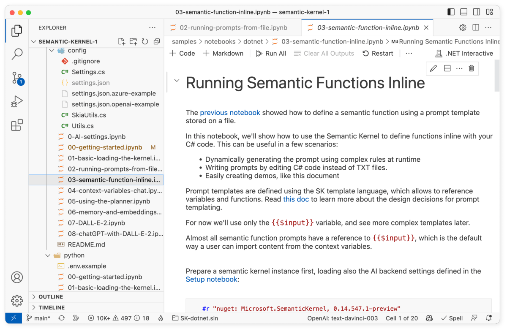

# Running semantic functions inline

The following steps walk through the _03-semantic-function-inline.ipynb_ notebook in the `/dotnet/notebooks` or `/python/notebooks` folder. We recommend following along in the notebook so that you can easily run the code snippets by pressing the run button next to each code snippet.

| Language | File | Link |
| --- | --- | --- |
| C# | _/dotnet/notebooks/03-semantic-function-inline.ipynb_ | [Open notebook in GitHub](https://github.com/microsoft/semantic-kernel/blob/main/dotnet/notebooks/03-semantic-function-inline.ipynb) |
| Python | _/python/notebooks/03-semantic-function-inline.ipynb_ | [Open notebook in GitHub](https://github.com/microsoft/semantic-kernel/blob/main/python/notebooks/03-semantic-function-inline.ipynb) |





## 1) Load and configure the kernel
In this guide, we'll show how to load a semantic function in the kernel without using plugin files. To begin, load and configure the kernel as usual. The following code snippets use the configuration that was created in the [getting started notebook](./getting-started.md).

# [C#](#tab/Csharp)

```csharp
#r "nuget: Microsoft.SemanticKernel"

#!import config/Settings.cs

using Microsoft.SemanticKernel;

var kernel = KernelBuilder.Create();

// Configure AI backend used by the kernel
var (useAzureOpenAI, model, azureEndpoint, apiKey, orgId) = Settings.LoadFromFile();
if (useAzureOpenAI)
    kernel.Config.AddAzureTextCompletionService(model, azureEndpoint, apiKey);
else
    kernel.Config.AddOpenAITextCompletionService(model, apiKey, orgId);
```

# [Python](#tab/python)

```python
import semantic_kernel as sk
from semantic_kernel.connectors.ai.open_ai import AzureTextCompletion, OpenAITextCompletion

kernel = sk.Kernel()

useAzureOpenAI = False

# Configure AI service used by the kernel
if useAzureOpenAI:
    deployment, api_key, endpoint = sk.azure_openai_settings_from_dot_env()
    kernel.add_text_completion_service("dv", AzureTextCompletion(deployment, endpoint, api_key))
else:
    api_key, org_id = sk.openai_settings_from_dot_env()
    kernel.add_text_completion_service("dv", OpenAITextCompletion("text-davinci-003", api_key, org_id))
```

---


## 2) Create the text for the prompt template
In this guide, we'll create a simple prompt that summarizes the content of a given input.

# [C#](#tab/Csharp)

```csharp
string skPrompt = """
{{$input}}

Summarize the content above.
""";
```


# [Python](#tab/python)

```python
prompt = """{{$input}}
Summarize the content above.
"""
```

---

## 3) Set the configuration and load it into the kernel
Next, we'll set the configuration for the semantic function and load it into the kernel. In this example we're setting the `MaxTokens`, `Temperature`, and `TopP` parameters. If you want to learn more about these parameters, see the [configure prompts](../../prompt-engineering/configure-prompts.md) documentation.

# [C#](#tab/Csharp)
In C#, we'll create a `PromptTemplateConfig` object and set the configuration parameters. 

```csharp
var promptConfig = new PromptTemplateConfig
{
    Completion =
    {
        MaxTokens = 2000,
        Temperature = 0.2,
        TopP = 0.5,
    }
};
```

Afterwards, we prepare an instance of the prompt template, passing in the prompt text and the above configuration.

```csharp
var promptTemplate = new PromptTemplate(
    skPrompt,                        // Prompt template defined in natural language
    promptConfig,                    // Prompt configuration
    kernel                           // SK instance
);
```

Finally, we can register the semantic function in the kernel by passing in the prompt template and the name of the plugin and function.

```csharp
var functionConfig = new SemanticFunctionConfig(promptConfig, promptTemplate);

var summaryFunction = kernel.RegisterSemanticFunction("MySkill", "Summary", functionConfig);
```

If you want to register a function more succinctly, you can use the `CreateSemanticFunction` method.

```csharp
var summaryFunction = kernel.CreateSemanticFunction(skPrompt, maxTokens: 2000, temperature: 0.2, topP: 0.5);
```

# [Python](#tab/python)
In Python, we can simply pass the prompt and configuration parameters directly into the `create_semantic_function` method.

```python
summarize = kernel.create_semantic_function(prompt, max_tokens=2000, temperature=0.2, top_p=0.5)
```

---

## 4) Test the semantic function
Now that we've loaded the semantic function into the kernel, we can test it out by calling the function with a given input. In this example, we'll pass in a paragraph of text and see what the semantic function returns.

# [C#](#tab/Csharp)

```csharp
var input = """
Demo (ancient Greek poet)
From Wikipedia, the free encyclopedia
Demo or Damo (Greek: Δεμώ, Δαμώ; fl. c. AD 200) was a Greek woman of the Roman period, known for a single epigram, engraved upon the Colossus of Memnon, which bears her name. She speaks of herself therein as a lyric poetess dedicated to the Muses, but nothing is known of her life.[1]
Identity
Demo was evidently Greek, as her name, a traditional epithet of Demeter, signifies. The name was relatively common in the Hellenistic world, in Egypt and elsewhere, and she cannot be further identified. The date of her visit to the Colossus of Memnon cannot be established with certainty, but internal evidence on the left leg suggests her poem was inscribed there at some point in or after AD 196.[2]
Epigram
There are a number of graffiti inscriptions on the Colossus of Memnon. Following three epigrams by Julia Balbilla, a fourth epigram, in elegiac couplets, entitled and presumably authored by "Demo" or "Damo" (the Greek inscription is difficult to read), is a dedication to the Muses.[2] The poem is traditionally published with the works of Balbilla, though the internal evidence suggests a different author.[1]
In the poem, Demo explains that Memnon has shown her special respect. In return, Demo offers the gift for poetry, as a gift to the hero. At the end of this epigram, she addresses Memnon, highlighting his divine status by recalling his strength and holiness.[2]
Demo, like Julia Balbilla, writes in the artificial and poetic Aeolic dialect. The language indicates she was knowledgeable in Homeric poetry—'bearing a pleasant gift', for example, alludes to the use of that phrase throughout the Iliad and Odyssey.[a][2] 
""";

var summary = await summaryFunction.InvokeAsync(input);

Console.WriteLine(summary);
```

# [Python](#tab/python)

```python
input_text = """
Demo (ancient Greek poet)
From Wikipedia, the free encyclopedia
Demo or Damo (Greek: Δεμώ, Δαμώ; fl. c. AD 200) was a Greek woman of the Roman period, known for a single epigram, engraved upon the Colossus of Memnon, which bears her name. She speaks of herself therein as a lyric poetess dedicated to the Muses, but nothing is known of her life.[1]
Identity
Demo was evidently Greek, as her name, a traditional epithet of Demeter, signifies. The name was relatively common in the Hellenistic world, in Egypt and elsewhere, and she cannot be further identified. The date of her visit to the Colossus of Memnon cannot be established with certainty, but internal evidence on the left leg suggests her poem was inscribed there at some point in or after AD 196.[2]
Epigram
There are a number of graffiti inscriptions on the Colossus of Memnon. Following three epigrams by Julia Balbilla, a fourth epigram, in elegiac couplets, entitled and presumably authored by "Demo" or "Damo" (the Greek inscription is difficult to read), is a dedication to the Muses.[2] The poem is traditionally published with the works of Balbilla, though the internal evidence suggests a different author.[1]
In the poem, Demo explains that Memnon has shown her special respect. In return, Demo offers the gift for poetry, as a gift to the hero. At the end of this epigram, she addresses Memnon, highlighting his divine status by recalling his strength and holiness.[2]
Demo, like Julia Balbilla, writes in the artificial and poetic Aeolic dialect. The language indicates she was knowledgeable in Homeric poetry—'bearing a pleasant gift', for example, alludes to the use of that phrase throughout the Iliad and Odyssey.[a][2] 
"""

# If needed, async is available too: summary = await summarize.invoke_async(input_text)
summary = summarize(input_text)

print(summary)
```

---

After running the code, you should see an output similar to the following.

```output
Demo was a Greek woman of the Roman period, known for a single epigram engraved upon the Colossus of Memnon. Her identity is unknown, but her poem was likely inscribed there in or after AD 196. The poem is a dedication to the Muses, in which Demo offers the gift of poetry to the hero Memnon. She writes in the artificial and poetic Aeolic dialect, indicating knowledge of Homeric poetry.
```

## 5) Try one more example
Let's try loading in one more semantic function inline. This time, we'll use a different semantic function that summarizes a given text. We'll call this function `tldr` since it should return a very concise summary of the input text.


# [C#](#tab/Csharp)

```csharp
var kernel = Microsoft.SemanticKernel.Kernel.Builder.Build();

var (useAzureOpenAI, model, azureEndpoint, apiKey, orgId) = Settings.LoadFromFile();

if (useAzureOpenAI)
    kernel.Config.AddAzureTextCompletionService(model, azureEndpoint, apiKey);
else
    kernel.Config.AddOpenAITextCompletionService(model, apiKey, orgId);


string skPrompt = @"
{{$input}}

Give me the TLDR in 5 words.
";

var textToSummarize = @"
    1) A robot may not injure a human being or, through inaction,
    allow a human being to come to harm.

    2) A robot must obey orders given it by human beings except where
    such orders would conflict with the First Law.

    3) A robot must protect its own existence as long as such protection
    does not conflict with the First or Second Law.
";

var tldrFunction = kernel.CreateSemanticFunction(skPrompt, maxTokens: 200, temperature: 0, topP: 0.5);

var summary = await tldrFunction.InvokeAsync(textToSummarize);

Console.WriteLine(summary);
```

# [Python](#tab/python)

```python
sk_prompt = """
{{$input}}

Give me the TLDR in 5 words.
"""

text = """
    1) A robot may not injure a human being or, through inaction,
    allow a human being to come to harm.

    2) A robot must obey orders given it by human beings except where
    such orders would conflict with the First Law.

    3) A robot must protect its own existence as long as such protection
    does not conflict with the First or Second Law.
"""

tldr_function = kernel.create_semantic_function(sk_prompt, max_tokens=200, temperature=0, top_p=0.5)

summary = tldr_function(text)

print(f"Output: {summary}")
```

---

After running the code, you should see an output similar to the following.

```output
Robots must not harm humans.
```

## Next steps

Great! Now that you know how to load a semantic function using inline code, you can now move on to the next step in the [quick start guide](index.md) to learn how to set additional context variables.

| File | Link | Description |
| --- | --- | --- |
| _00-getting-started.ipynb_| [Open guide](./getting-started.md)| Run your first prompt  |
| _01-basic-loading-the-kernel.ipynb_ | [Open guide](./loading-the-kernel.md) | Changing the configuration of the kernel |
| _02-running-prompts-from-file.ipynb_ | [Open guide](./running-prompts-from-files.md) | Learn how to run prompts from a file |
| _03-semantic-function-inline.ipynb_ | **You are here** | Configure and run prompts directly in code | 
| _04-context-variables-chat.ipynb_ | [Open guide](./context-variables-chat.md) | Use variables to make prompts dynamic |
| _05-using-the-planner.ipynb_ | [Open guide](./using-the-planner.md) | Dynamically create prompt chains with planner |
| _06-memory-and-embeddings.ipynb_ | [Open guide](./memory-and-embeddings.md) | Store and retrieve memory with embeddings |


> [!div class="nextstepaction"]
> [Set context variables](./context-variables-chat.md)

