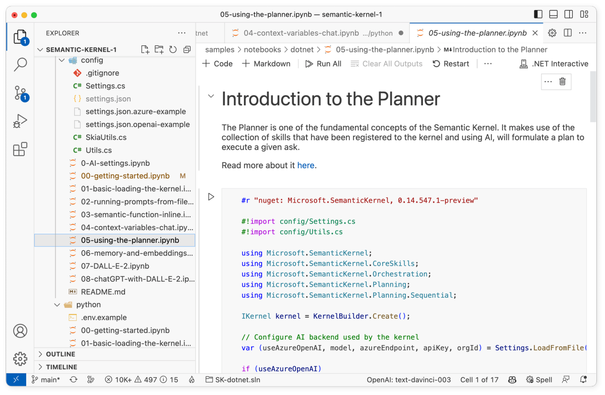

# Using planner 

The following steps walk through the _05-using-the-planner.ipynb_ notebook in the `/dotnet/notebooks` or `/python/notebooks` folder. We recommend following along in the notebook so that you can easily run the code snippets by pressing the run button next to each code snippet.

| Language | File | Link |
| --- | --- | --- |
| C# | _/dotnet/notebooks/05-using-the-planner.ipynb_ | [Open notebook in GitHub](https://github.com/microsoft/semantic-kernel/blob/main/dotnet/notebooks/05-using-the-planner.ipynb) |
| Python | _/python/notebooks/05-using-the-planner.ipynb_ | [Open notebook in GitHub](https://github.com/microsoft/semantic-kernel/blob/main/python/notebooks/05-using-the-planner.ipynb) |





## 1) Load and configure the kernel
In this guide, we'll show you how to use planner. Planner is one of the fundamental concepts of the Semantic Kernel. It makes use of the collection of plugins that have been registered to the kernel, and by using AI, will formulate a plan to execute a given ask. To begin, load and configure the kernel as usual. The following code snippets use the configuration that was created in the [getting started notebook](./getting-started.md).

> [!Note]
> Coming up with a plan using multiple plugins is an advanced AI capability. For this reason, we recommend using GPT-4 or an equivalent AI model to get the best results.

# [C#](#tab/Csharp)

```csharp
#r "nuget: Microsoft.SemanticKernel"

#!import config/Settings.cs

using Microsoft.SemanticKernel;

var kernel = KernelBuilder.Create();

// Configure AI backend used by the kernel
var (useAzureOpenAI, model, azureEndpoint, apiKey, orgId) = Settings.LoadFromFile();
if (useAzureOpenAI)
    kernel.Config.AddAzureTextCompletionService(model, azureEndpoint, apiKey);
else
    kernel.Config.AddOpenAITextCompletionService(model, apiKey, orgId);
```

# [Python](#tab/python)

```python
import semantic_kernel as sk
from semantic_kernel.connectors.ai.open_ai import AzureTextCompletion, OpenAITextCompletion

kernel = sk.Kernel()

useAzureOpenAI = False

# Configure AI service used by the kernel
if useAzureOpenAI:
    deployment, api_key, endpoint = sk.azure_openai_settings_from_dot_env()
    kernel.add_text_completion_service("dv", AzureTextCompletion(deployment, endpoint, api_key))
else:
    api_key, org_id = sk.openai_settings_from_dot_env()
    kernel.add_text_completion_service("dv", OpenAITextCompletion("text-davinci-003", api_key, org_id))
```

---


## 2) Setting up planner
With planners, you can dynamically create chains of functions to satisfy a given ask. Here we will be using a basic planner that will create a sequential plan. To get started, we will first instantiate planner.

# [C#](#tab/Csharp)

```csharp
// Load native function into the kernel registry, sharing its functions with prompt templates
var planner = new SequentialPlanner(kernel);
```


# [Python](#tab/python)

```python
from semantic_kernel.planning.basic_planner import BasicPlanner
planner = BasicPlanner()
```

---

## 3) Provide plugins to planner
Before you can use planner, you'll need to provide it with plugins. Plugins are the basic building blocks used by planner to create a plan. In this example, we'll be using the `SummarizePlugin` and `WriterPlugin` sample plugins.

To provide planner with plugins, we'll need to first import the plugins into the kernel so that they can be provided to planner.

# [C#](#tab/Csharp)

```csharp
var pluginsDirectory = Path.Combine(System.IO.Directory.GetCurrentDirectory(), "..", "..", "plugins");
kernel.ImportSemanticFunctionsFromDirectory(pluginsDirectory, "SummarizePlugin");
kernel.ImportSemanticFunctionsFromDirectory(pluginsDirectory, "WriterPlugin");
```


# [Python](#tab/python)

```python
from semantic_kernel.core_skills.text_skill import TextPlugin

skills_directory = "../../skills/"
summarize_skill = kernel.import_semantic_skill_from_directory(skills_directory, "SummarizePlugin")
writer_skill = kernel.import_semantic_skill_from_directory(skills_directory, "WriterPlugin")
text_skill = kernel.import_skill(TextPlugin(), "TextPlugin")
```

---

## 4) Make a request to planner
Now that we have planner and plugins configured, we can finally make a request. We'll do so by creating a variable called `ask` that contains the goal we want to achieve and then passing it to planner. Planner will then create a plan to achieve the goal that we can inspect.

# [C#](#tab/Csharp)

```csharp
var ask = "Tomorrow is Valentine's day. I need to come up with a few date ideas and e-mail them to my significant other.";
var originalPlan = await planner.CreatePlanAsync(ask);

Console.WriteLine("Original plan:\n");
Console.WriteLine(JsonSerializer.Serialize(originalPlan, new JsonSerializerOptions { WriteIndented = true }));
```

# [Python](#tab/python)

```python
ask = """
Tomorrow is Valentine's day. I need to come up with a few date ideas. She speaks French so write it in French.
Convert the text to uppercase"""
original_plan = await planner.create_plan_async(ask, kernel)
```

---


## 5) Inspect the plan
After running the code above, you should a JSON output that looks something like this.


# [C#](#tab/Csharp)

```json
{
  "state": [
    {
      "Key": "INPUT",
      "Value": ""
    }
  ],
  "steps": [
    {
      "state": [
        {
          "Key": "INPUT",
          "Value": ""
        }
      ],
      "steps": [],
      "parameters": [
        {
          "Key": "INPUT",
          "Value": "Valentine\u0027s Day Date Ideas"
        }
      ],
      "outputs": [
        "DATE_IDEAS"
      ],
      "next_step_index": 0,
      "name": "Brainstorm",
      "skill_name": "WriterPlugin",
      "description": "Given a goal or topic description generate a list of ideas"
    },
    {
      "state": [
        {
          "Key": "INPUT",
          "Value": ""
        }
      ],
      "steps": [],
      "parameters": [
        {
          "Key": "INPUT",
          "Value": "$DATE_IDEAS"
        }
      ],
      "outputs": [
        "EMAIL_TEXT"
      ],
      "next_step_index": 0,
      "name": "EmailGen",
      "skill_name": "WriterPlugin",
      "description": "Write an email from the given bullet points"
    }
  ],
  "parameters": [
    {
      "Key": "INPUT",
      "Value": ""
    }
  ],
  "outputs": [],
  "next_step_index": 0,
  "name": "",
  "skill_name": "Microsoft.SemanticKernel.Planning.Plan",
  "description": "Tomorrow is Valentine\u0027s day. I need to come up with a few date ideas and e-mail them to my significant other."
}
```

In this example, we can see that planner has created a plan with two steps. The first step is to brainstorm ideas for a Valentine's day date and the second step is to generate an e-mail from the ideas generated in the first step. Notice how planner is smart enough to know that the second step depends on the first step and correctly passes the output using the `$` syntax.

# [Python](#tab/python)

```json
{
  "input": "Valentine's Day Date Ideas",
  "subtasks": [
    {"function": "WriterPlugin.Brainstorm"},
    {"function": "WriterPlugin.Translate", "args": {"language": "French"}},
    {"function": "TextPlugin.uppercase"}
  ]
}
```

In this example, we can see that planner has created a plan with three steps. The first step is to brainstorm ideas for a Valentine's day date, the second translates it to French, and the last step converts it to uppercase.

---


## 5) Adding an additional function to planner
Let's say that we want to add an additional step to the plan that rewrites the e-mail in the style of Shakespeare. To do so, we'll need to create a function that takes in the e-mail text and rewrites it in the style of Shakespeare. We'll then add the function to the kernel and re-run planner with a new ask to see the updated plan.

# [C#](#tab/Csharp)

```csharp
string skPrompt = """
{{$input}}

Rewrite the above in the style of Shakespeare.
""";
var shakespeareFunction = kernel.CreateSemanticFunction(skPrompt, "shakespeare", "ShakespearePlugin", maxTokens: 2000, temperature: 0.2, topP: 0.5);

var ask = @"Tomorrow is Valentine's day. I need to come up with a few date ideas.
She likes Shakespeare so write using his style. E-mail these ideas to my significant other";

var newPlan = await planner.CreatePlanAsync(ask);

Console.WriteLine("Updated plan:\n");
Console.WriteLine(JsonSerializer.Serialize(newPlan, new JsonSerializerOptions { WriteIndented = true }));
```


# [Python](#tab/python)

```python
sk_prompt = """
{{$input}}

Rewrite the above in the style of Shakespeare.
"""
shakespeareFunction = kernel.create_semantic_function(sk_prompt, "shakespeare", "ShakespearePlugin",
                                                      max_tokens=2000, temperature=0.8)

ask = """
Tomorrow is Valentine's day. I need to come up with a few date ideas.
She likes Shakespeare so write using his style. She speaks French so write it in French.
Convert the text to uppercase."""

new_plan = await planner.create_plan_async(ask, kernel)
```

---


## 6) Execute the plans
Now that we have the plans, we can execute them and see the results. We'll start by executing the original plan and then the updated plan.

# [C#](#tab/Csharp)

```csharp
var originalPlanResult = await originalPlan.InvokeAsync();

Console.WriteLine("Original Plan results:\n");
Console.WriteLine(Utils.WordWrap(originalPlanResult.Result, 100));

```

After running the original plan above, you should see an output that looks something like this.

```output
Original Plan results:

We could cook dinner together, take a romantic walk, have a picnic in a park, have a movie night,
visit a museum, take a cooking class, go to a spa, go to a concert, go ice skating, or visit an
aquarium. All of these activities would be a great way to spend quality time together.
```

# [Python](#tab/python)

```python
original_results = await planner.execute_plan_async(original_plan, kernel)
print(original_results)
```

After running the original plan above, you should see an output that looks something like this.

```output
1. FAITES UNE PROMENADE ROMANTIQUE DANS LE PARC
2. CUISINEZ ENSEMBLE
3. PRENEZ UN COURS DE CUISINE
4. PROFITEZ D'UN PIQUE-NIQUE DANS LA COUR ARRIÈRE
5. ALLEZ À UN MUSÉE
6. FAITES UNE SOIRÉE CINÉMA
7. VISITEZ UNE CAVE LOCALE
8. PRENEZ UN COURS DE DANSE
9. FAITES UNE BALADE PANORAMIQUE
10. FAITES UNE SOIRÉE SPA
```

---


# [C#](#tab/Csharp)

```csharp
var newPlanResult = await kernel.RunAsync(newPlan);
Console.WriteLine("New Plan results:\n");
Console.WriteLine(newPlanResult.Result);
```

After running the new plan above, you should see an output that looks something like this. Notice how the e-mail text has been rewritten in the style of Shakespeare.

```output
New Plan results:

1. Take a romantic peregrination upon the strand.
2. Visit a sumptuous eatery.
3. Pen each other amorous epistles.
4. Prepare a romantic repast at home.
5. Attend a mirthful performance.
6. Visit a proximate vineyard.
7. Embark upon a hot air balloon voyage.
8. Attend a drive-in cine.
9. Take a dance lesson in tandem.
10. Have a collation in the pleasance.
```

# [Python](#tab/python)

```python
new_results = await planner.execute_plan_async(new_plan, kernel)
print(new_results)
```

After running the new plan above, you should see an output that looks something like this. Notice how the e-mail text has been rewritten in the style of Shakespeare.

```output
1. ALLONS À UN DÎNER ROMANTIQUE DÈS MAINTENANT !
2. NOUS PARTIRONS VERS LA CAVE LOCALE !
3. NOUS CHERCHERONS UNE PROMENADE ROMANTIQUE DANS UN PARC !
4. NOUS CHERCHERONS LES INGRÉDIENTS D'UN PIQUE-NIQUE ROMANTIQUE !
5. ALLONS VITE AU MUSÉE LOCAL !
6. NOUS ENTREPRENDRONS ENSEMBLE UNE CLASSE DE CUISINE !
7. REGARDONS ET PARTAGEONS UN FILM ROMANTIQUE !
8. ALLONS VOIR LA ZOO LOCALE !
9. DES RIRES S'ENSUIVRONT LORSQUE NOUS IRONS AU SPECTACLE DE COMÉDIE !
10. NOTRE PROMENADE EN BATEAU ROMANTIQUE COULERA À TRAVERS LES EAUX.
```

---


## Next steps
Now that you know how to use planner, you can now move on to the next step in the [quick start guide](index.md) to learn how to store and retrieve memories using embeddings.

| File | Link | Description |
| --- | --- | --- |
| _00-getting-started.ipynb_| [Open guide](./getting-started.md)| Run your first prompt  |
| _01-basic-loading-the-kernel.ipynb_ | [Open guide](./loading-the-kernel.md) | Changing the configuration of the kernel |
| _02-running-prompts-from-file.ipynb_ | [Open guide](./running-prompts-from-files.md) | Learn how to run prompts from a file |
| _03-semantic-function-inline.ipynb_ | [Open guide](./semantic-function-inline.md) | Configure and run prompts directly in code | 
| _04-context-variables-chat.ipynb_ | [Open guide](./context-variables-chat.md) | Use variables to make prompts dynamic |
| _05-using-the-planner.ipynb_ | **You are here** | Dynamically create prompt chains with planners |
| _06-memory-and-embeddings.ipynb_ | [Open guide](./memory-and-embeddings.md) | Store and retrieve memory with embeddings |


> [!div class="nextstepaction"]
> [Store and retrieve memories](./memory-and-embeddings.md)

