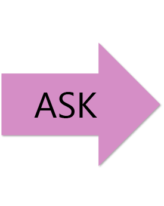
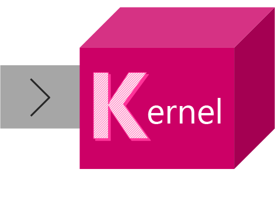
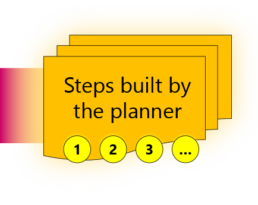
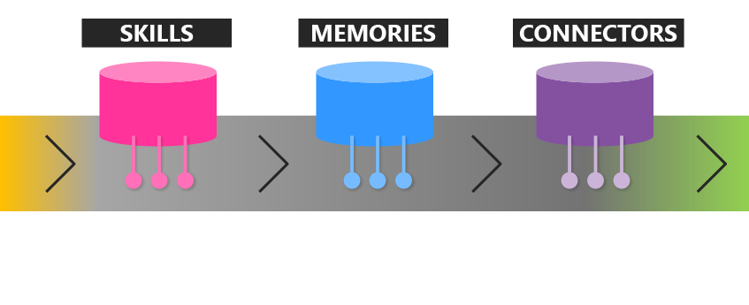
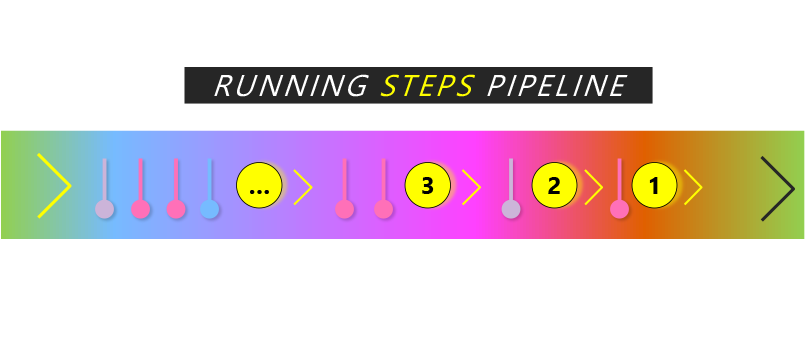
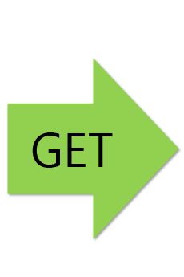

# What is Semantic Kernel?

**Semantic Kernel (SK) is a lightweight SDK that lets you easily mix conventional programming languages with the latest in Large Language Model (LLM) AI "prompts" with templating, chaining, and planning capabilities out-of-the-box.**

With SK, you can now build AI-first apps faster by design while also having a front-row peek at how the SDK is being built. SK has been released as open-source so that more pioneering developers can join us in crafting the future of this landmark moment in the history of computing.

SK is engineered to accelerate Microsoft teams' understandings of the continual evolution of LLM AIs — directly connecting into the practice of integrating LLM AI into existing apps. With SK, it's easier to accelerate your innovations' time to market, and to manage for reliability and performance in the long run.

## SK is a kit of parts that all interlock

With their increasing ability to understand complex intents, LLM AIs are enabling a more "goal-oriented" approach to problem solving. Therefore, SK was created to start with an "ask" in mind — that gets driven to a dynamically informed outcome with the orchestration capabilities of the kernel. The flow from a user's ask to getting what the user asked for with SK can be visualized as a flow of connected parts:

| Journey Phase** | Short Description |
|:---:|:---|
|  | A user's goal is sent to SK as an ask |
|  | The kernel orchestrates a user's ask |
|  | The planner breaks it down into steps |
|  | The steps get enriched with skills, memories, and connectors |
|  | Execution of the steps results in fulfilling the user's ask |
|  | And the user gets what they asked for |

**_Note that this diagram is not technically accurate and is provided to explain the general flow of how SK works. Please refer to the actual source code to examine its underlying architecture._

## SK gets your LLM AI journey started  

**[Get started](getting-started/setup) with Semantic Kernel.** Within minutes you can create templated prompts, chained prompts, and reusable skills as pure prompts, native code, or hybrid prompts × code. And soon afterwards, you'll be breaking the barrier to ultra-long prompts with embeddings while summoning even more power from any external APIs.
 

> [!VIDEO https://aka.ms/SK-First-Steps]

## SK makes app developers' work lives easier

1. **Fast Integration:** SK is designed to be embedded in any kind of application, making it easy for developers to add LLM AI functionality to test inside their apps.

2. **Power Prompting:** Plain prompts that are fed as API calls can only get you so far. SK provides the abstractions and machinery to unlock your OpenAI or Azure OpenAI API key.

3. **Novel-But-Familiar:** For 100% determininism, native code is always available as a first-class partner on your prompt engineering quests. You get the best of both worlds.

## SK is for developers facing new pressures

| 1️⃣  You, or your boss, have noticed that ChatGPT has gotten a lot of attention. | 2️⃣   There's a big push to do something similar with LLM AI in your app ... _asap._ | 3️⃣  You quickly learn that making AI tell a joke is easy. Everything else isn't. |  4️⃣   Rather than waste time on LLM AI itself, you want to work on your app instead. |
| --- | --- | --- | --- |

## SK is under construction and is hungry for feedback

Given that new breakthroughs in LLM AIs are landing on a daily basis, you should consider this SDK a work-in-progress as the team's "best-guess practices" for adding semantically-rich AI to existing apps. And since there are still so many unknown-unknowns in this kind of work, we defer to the community's feedback and contributions to find even better practices going forward. Together.