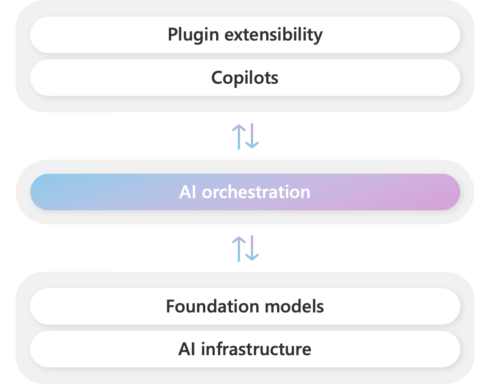
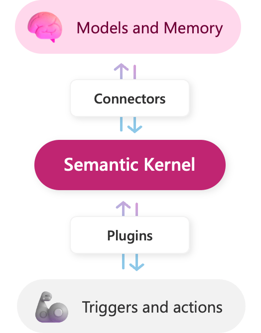

# What is Semantic Kernel?

Semantic Kernel is an open-source SDK that lets you easily build agents that can call your existing code. As a highly extensible SDK, you can use Semantic Kernel with models from [OpenAI](https://platform.openai.com/docs/), [Azure OpenAI](https://azure.microsoft.com/products/cognitive-services/openai-service/), [Hugging Face](https://huggingface.co/), and more! By combining your existing C#, Python, and Java code with these models, you can build agents that answer questions and automate processes.

## Semantic Kernel is at the center of the agent stack

:::row:::
   :::column span="":::
        
   :::column-end:::
   :::column span="":::
      During Kevin Scott's talk [The era of the AI Copilot](https://build.microsoft.com/sessions/bb8f9d99-0c47-404f-8212-a85fffd3a59d?source=/speakers/ef864919-5fd1-4215-b611-61035a19db6b), he demonstrated how Microsoft powers its [Copilot system](https://www.youtube.com/watch?v=E5g20qmeKpg) with a stack consisting of of AI models and plugins. At the center of this stack is an AI orchestration layer that allows Microsoft to combine AI models and plugins together to create brand new experiences for users.

      To help developers build their _own_ Copilot experiences on top of AI plugins, we have released Semantic Kernel, a lightweight open-source SDK that allows you to orchestrate plugins (i.e., your existing code) with AI. With Semantic Kernel, you can leverage the _same_ AI orchestration patterns that power Microsoft's Copilots in your _own_ apps.
   :::column-end:::
:::row-end:::

> [!TIP]
> If you are interested in seeing a sample of the copilot stack in action (with Semantic Kernel at the center of it), check out [Project Miyagi](https://github.com/Azure-Samples/miyagi). Project Miyagi reimagines the design, development, and deployment of intelligent applications on top of Azure with all of the latest AI services and tools.

## Why use an SDK like Semantic Kernel?
Today's AI models can easily generate messages and images for users. While this is helpful when building a simple chat app, it is not enough to build fully automated AI agents that can automate business processes and empower users to achieve more. To do so, you would need a framework that can take the responses from these models and use them to call existing code to _actually_ do something productive.

With Semantic Kernel, we've done just that. We've created an SDK that allows you to easily describe your existing code to AI models so they can request that they be called. Afterwards, Semantic Kernel does the heavy lifting of translating the model's response into a call to your code.

To see how this works, let's build a simple AI agent that can turn on and off a lightbulb.

### How many agents does it take to change a lightbulb?
Let's say you wanted an AI agent to be able to turn on and off a lightbulb. In a real business scenario, you may want the AI to perform more complex tasks, like send emails, update databases, and more, but even in those scenarios, you would still follow the same steps.

First, you need code that can change the state of the lightbulb. This is fairly simple to do with a few lines of C# code. Below we create our `LightPlugin` class that has two methods, `GetState` and `ChangeState`.

:::code language="csharp" source="~/../semantic-kernel-samples/samples/DocumentationExamples/Plugin.cs" id="LightPlugin":::

Notice that we've added a few attributes to the methods, `[KernelFunction]` and `[Description]`. Whenever you want an AI to call your code, you need to first describe it to the AI so it knows how to _actually_ use it. In this case, we've described two functions, `GetState` and `ChangeState`, so the AI can request that they be called.

Now that we have our code, we now need to provide it to the AI. This is where Semantic Kernel comes in. With Semantic Kernel, we can create a single `Kernel` object that has all the information necessary to orchestrate our code with AI. To do so, we'll create a new `Kernel` object and pass it our `LightPlugin` class and the model we want to use:

:::code language="csharp" source="~/../semantic-kernel-samples/samples/DocumentationExamples/Plugin.cs" id="KernelCreation":::

Now that we have a kernel, we can use it to create an agent that will call our code whenever its prompted to do so. Let's simulate a back-and-forth chat with a `while` loop:

:::code language="csharp" source="~/../semantic-kernel-samples/samples/DocumentationExamples/Plugin.cs" id="Chat":::

After running these _few_ lines of code, you should be able to have a conversation with your AI agent:

```console
User > Hello
Assistant > Hello! How can I assist you today?
User > Can you turn on the lights
[Light is now on]
Assistant > I have turned on the lights for you.
```

While this is just a simple example of how you can use Semantic Kernel, it quickly shows the power of the SDK and just how easy it is to use to automate tasks. To recreate a similar experience with other AI SDKs, you would easily need to write twice as much code.

### Semantic Kernel makes AI development extensible
:::row:::
   :::column span="2":::

      Semantic Kernel has been engineered to easy to add your existing code to your AI agents with [plugins](../create-plugins/index.md). With plugins, you can give your agents the ability to interact with the real-world by calling your existing apps and services. In this way, plugins are like the "arms and hands" of your AI app.

      Additionally, Semantic Kernel's interfaces allow it to flexibly integrate any AI service.  This is done with a set of connectors that make it easy to add [memories](../memories/index.md) and AI models. In this way, Semantic Kernel is able to add a simulated "brain" to your app that you can easily swap out as newer and better AI models become available.

      Because of the extensibility Semantic Kernel provides with connectors and [plugins](../create-plugins/index.md), you can use it to orchestrate nearly any of your existing code without being locked into a specific AI model provider. For example, if you built a bunch of plugins for OpenAI's ChatGPT, you could use Semantic Kernel to orchestrate them with models from other providers like Azure or Hugging Face.
   :::column-end:::
   :::column span="1":::
        
   :::column-end:::
:::row-end:::

As a developer, you can use the different components of Semantic Kernel separately. For example, if you _just_ need an abstraction over OpenAI and Azure OpenAI services, you could just use the SDK to run handcrafted prompts, but the _real_ power of Semantic Kernel comes from combining these components together.

## Get started using the Semantic Kernel SDK
Now that you know what Semantic Kernel is, follow the [get started](../get-started/index.md) link to try it out. Within minutes you can create prompts and chain them with out-of-the-box plugins and native code. Soon afterwards, you can give your apps memories with embeddings and summon even more power from external APIs.

> [!div class="nextstepaction"]
> [Get started with Semantic Kernel](../get-started/index.md)
