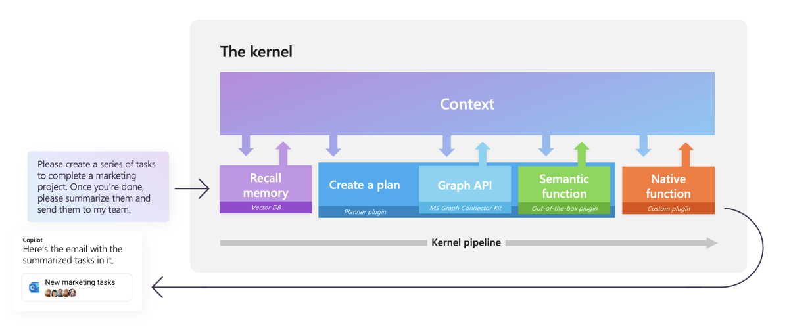

# What is Semantic Kernel?

[!INCLUDE [pat_large.md](../includes/pat_large.md)]

Semantic Kernel is an open-source SDK that lets you easily combine AI services like [OpenAI](https://platform.openai.com/docs/), [Azure OpenAI](https://azure.microsoft.com/products/cognitive-services/openai-service/), and [Hugging Face](https://huggingface.co/) with conventional programming languages like C# and Python. By doing so, you can create AI apps that combine the best of both worlds.

## Semantic Kernel is at the center of the copilot stack

:::row:::
   :::column span="":::
        
   :::column-end:::
   :::column span="":::
      During Kevin Scott's talk [The era of the AI Copilot](https://build.microsoft.com/sessions/bb8f9d99-0c47-404f-8212-a85fffd3a59d?source=/speakers/ef864919-5fd1-4215-b611-61035a19db6b), he showed how Microsoft powers its [Copilot system](https://www.youtube.com/watch?v=E5g20qmeKpg) with a stack of AI models and plugins. At the center of this stack is an AI orchestration layer that allows us to combine AI models and plugins together to create brand new experiences for users.

      To help developers build their _own_ Copilot experiences on top of AI plugins, we have released Semantic Kernel, a lightweight open-source SDK that allows you to orchestrate AI plugins. With Semantic Kernel, you can leverage the _same_ AI orchestration patterns that power Microsoft 365 Copilot and Bing in your _own_ apps, while still leveraging your existing development skills and investments.
   :::column-end:::
:::row-end:::

> [!TIP]
> If you are interested in seeing a sample of the copilot stack in action (with Semantic Kernel at the center of it), check out [Project Miyagi](https://github.com/Azure-Samples/miyagi). Project Miyagi reimagines the design, development, and deployment of intelligent applications on top of Azure with all of the latest AI services and tools.

### Semantic Kernel makes AI development extensible
:::row:::
   :::column span="2":::
      Semantic Kernel has been engineered to allow developers to flexibly integrate AI services into their existing apps. To do so, Semantic Kernel provides a set of connectors that make it easy to add [memories](../memories/index.md) and [models](../prompt-engineering/llm-models.md). In this way, Semantic Kernel is able to add a simulated "brain" to your app.

      Additionally, Semantic Kernel makes it easy to add skills to your applications with [AI plugins](../create-plugins/index.md) that allow you to interact with the real world. These plugins are composed of [prompts](../prompt-engineering/index.md) and [native functions](../create-chains/native-functions.md) that can respond to triggers and perform actions.  In this way, plugins are like the "body" of your AI app.

      Because of the extensibility Semantic Kernel provides with connectors and [plugins](../create-plugins/index.md), you can use it to orchestrate AI plugins from both OpenAI and Microsoft on top of nearly any model. For example, you can use Semantic Kernel to orchestrate plugins built for ChatGPT, Bing, and Microsoft 365 Copilot on top of models from OpenAI, Azure, or even Hugging Face.

   :::column-end:::
   :::column span="1":::
        
   :::column-end:::
:::row-end:::

As a developer, you can use these pieces individually or together. For example, if you just need an abstraction over OpenAI and Azure OpenAI services, you could use the SDK to _just_ run pre-configured prompts within your plugins, but the _real_ power of Semantic Kernel comes from combining these components together.

### Why do you need an AI orchestration SDK?
If you wanted, you could use the APIs for popular AI services directly and feed the results into your existing apps and services. This, however, requires you to learn the APIs for each service and then integrate them into your app. Using the APIs directly also does not allow you to easily draw from the recent advances in AI research that require solutions _on top_ of these services. For example, the existing APIs do not provide planning or AI memories out-of-the-box.

To simplify the creation of AI apps, open source projects like [LangChain](https://docs.langchain.com/docs/) have emerged. Semantic Kernel is Microsoft's contribution to this space and is designed to support enterprise app developers who want to integrate AI into their existing apps.

## Seeing AI orchestration with Semantic Kernel
By using multiple AI models, plugins, and memory all together within Semantic Kernel, you can create sophisticated pipelines that allow AI to automate complex tasks for users.

For example, with Semantic Kernel, you could create a pipeline that helps a user send an email to their marketing team. With [memory](../memories/index.md), you could retrieve information about the project and then use [planner](../create-chains/index.md) to autogenerate the remaining steps using available plugins (e.g., ground the user's ask with Microsoft Graph data, generate a response with GPT-4, and send the email). Finally, you can display a success message back to your user in your app using a custom plugin.

| Step | Component | Description |
|:-|:-|:-|
| **1** | Ask | It starts with a goal being sent to Semantic Kernel by either a user or developer. |
| **2** | Kernel | The [kernel](../create-chains/kernel.md) orchestrates a user's ask. To do so, the kernel runs a [pipeline / chain](../create-chains/index.md) that is defined by a developer. While the chain is run, a common context is provided by the kernel so data can be shared between functions. |
| **2.1** | Memories | With a specialized plugin, a developer can recall and store context in vector databases. This allows developers to simulate [memory](../memories/index.md) within their AI apps. |
| **2.2** | Planner | Developers can ask Semantic Kernel to auto create chains to address novel needs for a user. [Planner](../create-chains/planner.md) achieves this by mixing-and-matching plugins that have already been loaded into the kernel to create additional steps. This is similar to how ChatGPT, Bing, and Microsoft 365 Copilot combines plugins together in their experiences. |
| **2.3** | Connectors | To get additional data or to perform autonomous actions, you can use out-of-the-box plugins like the Microsoft Graph Connector kit or create a custom connector to provide data to your own services. |
| **2.4** | Custom plugins | As a developer, you can create custom plugins that run inside of Semantic Kernel. These plugins can consist of either LLM prompts (semantic functions) or native C# or Python code (native function). This allows you to add new AI capabilities and integrate your existing apps and services into Semantic Kernel. |
| **3** | Response | Once the kernel is done, you can send the response back to the user to let them know the process is complete. |

## Semantic Kernel is open-source
To make sure all developers can take advantage of our learnings building Copilots, we have released Semantic Kernel as an [open-source project](https://github.com/microsoft/semantic-kernel) on GitHub. Today, we provide the SDK in .NET and Python flavors (Typescript and Java are coming soon). For a full list of what is supported in each language, see [supported languages](../get-started/supported-languages.md).

:::image type="content" source="../media/github.png" alt-text="GitHub repo of Semantic Kernel":::

Given that new breakthroughs in LLM AIs are landing on a daily basis, you should expect this SDK evolve. We're excited to see what you build with Semantic Kernel and we look forward to your feedback and contributions so we can build the best practices together in the SDK.

> [!div class="nextstepaction"]
> [Open the Semantic Kernel repo](https://github.com/microsoft/semantic-kernel)

### Contribute to Semantic Kernel
We welcome contributions and suggestions from the Semantic Kernel community! One of the easiest ways to participate is to engage in discussions in the [GitHub repository](https://github.com/microsoft/semantic-kernel). Bug reports and fixes are welcome!

For new features, components, or extensions, please [open an issue](../get-started/contributing.md#reporting-issues) and discuss with us before sending a PR. This will help avoid rejections since it will allow us to discuss the impact to the larger ecosystem.

> [!div class="nextstepaction"]
> [Learn more about contributing](../get-started/contributing.md)

## Get started using the Semantic Kernel SDK
Now that you know what Semantic Kernel is, follow the [get started](../get-started/index.md) link to try it out. Within minutes you can create prompts and chain them with out-of-the-box plugins and native code. Soon afterwards, you can give your apps memories with embeddings and summon even more power from external APIs.

> [!div class="nextstepaction"]
> [Get started with Semantic Kernel](../get-started/index.md)
