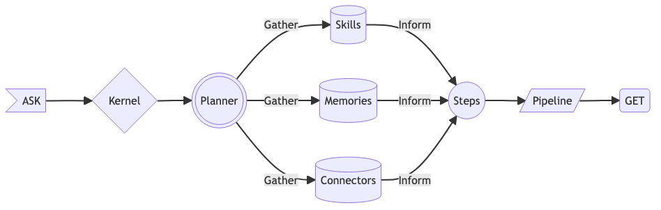

# What is Semantic Kernel?

[!INCLUDE [pat_small.md](../includes/pat_small.md)]

Semantic Kernel is a lightweight open-source orchestration SDK that lets you easily mix-and-match AI prompts with conventional programming languages like C# and Python. By combining native functions with AI, you can create apps that are more intelligent while still keeping the benefits of traditional code like determinism, performance, and reliability.

## Semantic Kernel is open-source
You may be familiar with the [Microsoft 365 Copilot System](https://www.youtube.com/watch?v=E5g20qmeKpg), the steps Microsoft uses to power its new Copilot experiences on top of GPT-4 and other AI models. This SDK formalizes many of the patterns Microsoft has developed while creating systems like these so that building LLM-powered apps can be made easier. To make sure all developers could take advantage of our learnings, we have released Semantic Kernel as an [open-source project](https://aka.ms/skrepo) on GitHub. 

Given that new breakthroughs in LLM AIs are landing on a daily basis, you should expect this SDK evolve as the broader community learns how to best add semantically-rich AI to existing apps. We're excited to see what you build with Semantic Kernel and we look forward to your feedback and contributions so we can build the best practices together in the SDK.

## The SDK simplifies the development of AI apps
Semantic Kernel has been engineered to allow developers to flexibly integrate AI into their existing apps. To do so, Semantic Kernel provides a set of abstractions that make it easy to create and manage prompts, native functions, memories, and connectors as individual components. You can then orchestrate these components with pipeline using Semantic Kernel APIs to complete users' requests or automate actions.

### Using individual pieces of Semantic Kernel

As a developer, you have the option to individually use the component pieces of Semantic Kernel within your example apps. For example, if you just need an easy-to-use abstraction over OpenAI and Azure OpenAI services, you could simply use the SDK to run pre-configured prompts. If you already integrate with LLMs, you could also use the SDK to simulate memory with the help of its embedding abstraction and its connectors to existing vector databases like Pinecone.

### Orchestrating components with Semantic Kernel pipelines
The real power of Semantic Kernel, however, comes from its ability to orchestrate these components together. By using multiple AI models, native functions, and memory all together within Semantic Kernel, you can create sophisticated pipelines that use AI to automate complex tasks. For example, with Semantic Kernel, you could create a pipeline that helps a user send a customer email. With memory, you could retrieve information about the customer and then use GPT-4 to generate a response. Finally, you could use a native function to automatically send the response to a user's email address.

Moreover, Semantic Kernel has been designed to automatically create novel pipelines using the components you've already created using Planner. For example, if you've already created components to generate and send emails, you could use the planner to automatically create a pipeline that uses those components to respond to customer requests, issues, or more. This baked-in intelligence compounds the value of your existing components by making it easy to reuse them in new and unexpected scenarios.

If you use _all_ of the pieces of Semantic Kernel to respond to a user's ask, you'll end up with a process that looks like this:

| Step | Description |
|:---:|:---|
| **Ask** | A user's goal is sent to Semantic Kernel as an ask |
| **Kernel** | [The kernel](/semantic-kernel/create-chains/kernel) orchestrates a user's ask |
| **Planner** | [The planner](/semantic-kernel/create-chains/planner) breaks it down into steps based upon resources that are available |
| **Resources** | Planning involves leveraging available [plugins](/semantic-kernel/create-plugins/index), [memories](/semantic-kernel/memories/index), and [connectors](/semantic-kernel/create-chains/connectors) |
| **Steps** | A plan is a series of steps for the kernel to execute |
| **Pipeline** | Executing the steps results in fulfilling the user's ask |
| **Response** | And the user gets what they asked for... |

<!-- ## Semantic Kernel is one part of the entire AI ecosystem -->

## Get started using the Semantic Kernel SDK
Now that you know what Semantic Kernel is, follow the [get started](/semantic-kernel/get-started) link to try it out. Within minutes you can create prompts and chain them with out-of-the-box plugins and native code. Soon afterwards, you can give your apps memories with embeddings and summon even more power from external APIs.

> [!VIDEO https://aka.ms/SK-First-Steps]

> [!div class="nextstepaction"]
> [Get started with Semantic Kernel](/semantic-kernel/get-started)

## Contributing to Semantic Kernel
We welcome contributions and suggestions from the Semantic Kernel community! One of the easiest ways to participate is to engage in discussions in the GitHub repository. Bug reports and fixes are welcome!

For new features, components, or extensions, please open an issue and discuss with us before sending a PR. This will help avoid rejections since it will allow us to discuss the impact to the larger ecosystem.

[!INCLUDE [footer.md](../includes/footer.md)]
