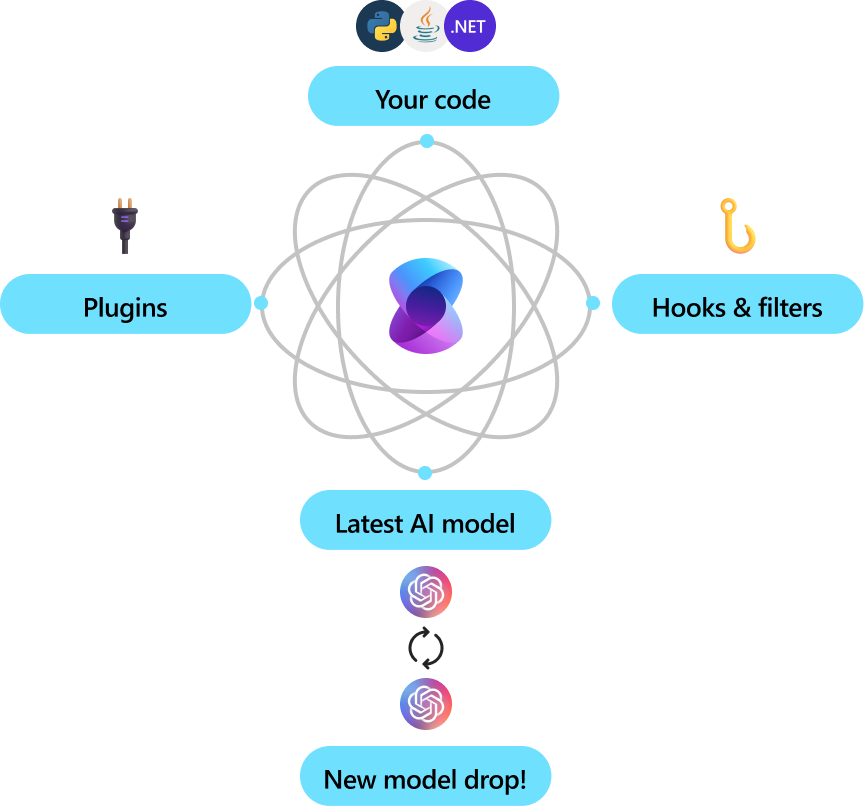

# Introduction to Semantic Kernel
Semantic Kernel is a lightweight, open-source development kit that lets you easily build AI agents and integrate the latest AI models into your C#, Python, or Java codebase. It serves as an efficient middleware that enables rapid delivery of enterprise-grade solutions.

## Enterprise ready
    :::column span="2":::
Microsoft and other Fortune 500 companies are already leveraging  Semantic Kernel because it’s flexible, modular, and observable. Backed with security enhancing capabilities like telemetry support, and hooks and filters so you’ll feel confident you’re delivering responsible AI solutions at scale. 
    
Version 1.0+ support across C#, Python, and Java means it’s reliable, committed to non breaking changes. Any existing chat-based APIs are easily expanded to support additional modalities like voice and video.

Semantic Kernel was designed to be future proof, easily connecting your code to the latest AI models evolving with the technology as it advances. When new models are released, you’ll simply swap them out without needing to rewrite your entire codebase.
:::column-end:::
    :::column span="2":::
    
:::column-end:::
:::row-end:::

## Automating business processes 
Semantic Kernel combines [prompts](../concepts/prompts.md) with [existing APIs](../concepts/plugins.md) to perform actions. By describing your existing code to AI models, they’ll be called to address requests. When a request is made the model it calls a function, Semantic Kernel is the middleware translating the model's request to a function call and passes the results back to the model.

## Modular and extensible
    :::column span="2":::
By adding your existing code as a plugin, you’ll maximize your investment by flexibly integrating AI services through a set of out-of-the-box connectors. Semantic Kernel uses OpenAPI specifications (like Microsoft 365 Copilot) so you can share any extensions with other pro or low-code developers in your company.
:::column-end:::
    :::column span="2":::
    
:::column-end:::

## Get started
Now that you know what Semantic Kernel is, get started with the quick start guide. You’ll build agents that automatically call functions to perform actions faster than any other SDK out there.
> [!div class="nextstepaction"]
> [Quickly get started](../get-started/quick-start-guide.md)
