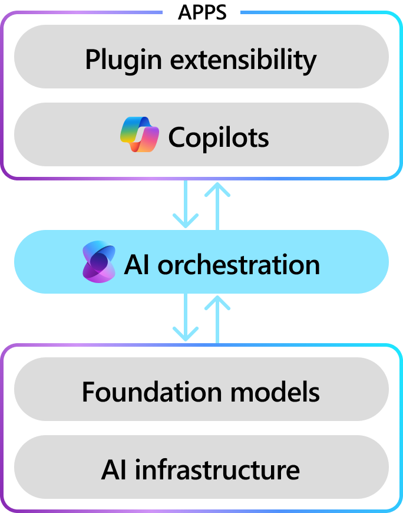

# Semantic Kernel: the enterprise AI SDK

:::row:::
   :::column span="":::
        Semantic Kernel is an open-source SDK that lets you easily build agents that call your existing code. As a highly extensible framework, it can be used with models from OpenAI, Azure OpenAI, Hugging Face, and more! By combining your existing C#, Python, and Java code with these models, you can build agents that answer questions and automate processes.
   :::column-end:::
   :::column span="":::
    
   :::column-end:::
:::row-end:::

## The AI SDK for automating business processes

:::row:::
   :::column span="":::
        Today's AI models can easily generate messages and images. While this is helpful for building chat apps, it’s not enough to build enterprise solutions that fully automate business processes. To do so, you need an SDK that can combine prompts with existing APIs to perform real work in the real world. <u>Semantic Kernel does just that</y>. With Semantic Kernel, you can easily describe your existing code to AI models so they can invoke them to address user needs. Whenever an LLM asks for a function to be invoked, Semantic Kernel then does the heavy lifting of translating the model's request into an actual function call and subsequently passes the results back to the LLM.
   :::column-end:::
   :::column span="":::
    
   :::column-end:::
:::row-end:::

## Semantic Kernel is enterprise first

As the AI SDK used by Microsoft and Fortune 500 companies, Semantic Kernel is designed to be scalable, observable, and safe. With features like Open Telemetry support, you can easily monitor your agents in production. And with hooks/filters, you can ensure that you always have control over what your agents do.

Unlike other other AI SDKs, Semantic Kernel is also _extremely_ lightweight. This means that you can easily integrate it into your existing codebase without layers of overly opinionated implementations of AI that will become obsolete in a few months. As a principle, Semantic Kernel is designed to be a thin layer that connects your code directly to AI models without getting in they way. As models evolve, you can easily swap them out without having to rewrite your entire codebase.

Lastly, with version 1.0+ support across C#, Python, and Java, you can also be confident that your investment in Semantic Kernel will be supported for years to come without breaking changes. The Semantic Kernel team is confident in the stability of the API because it models how humans interact with each other via chat. As AIs begin to support additional modalities like voice and video, Semantic Kernel will be able to easily support these new modalities as simple extensions to the existing chat-based APIs.

## Designed for modular extensibility

With Semantic Kernel, you'll be equipped to build future-proof solutions that evolve with your needs. Easily add your existing code through plugins to maximize your investment and innovation potential and flexibly integrate new and exiting AI services through a set of out-of-the-box connectors. 

:::row:::
   :::column span="":::
        Together, with you plugins and AI services, you can begin automating business process for you company and your customers. For example, if you built plugins to interact with a CRM system, you could use Semantic Kernel to orchestrate calls to get customers, email customers, and complete sales with models from Azure OpenAI, OpenAI, Mistral or Gemini.
   :::column-end:::
   :::column span="":::
    
   :::column-end:::
:::row-end:::

## Get started

Now that you know what Semantic Kernel is, try it out using the quick start guide. Within minutes you’ll be able to build an agent that can automatically call functions to perform actions for the user.