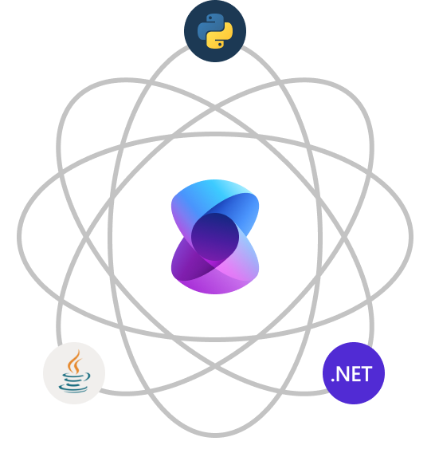

# Introduction to Semantic Kernel

Semantic Kernel is a lightweight, open-source SDK that lets you easily build AI agents and integrate the latest AI models into your C#, Python, or Java codebase, enabling rapid delivery of enterprise-ready solutions.

## Semantic Kernel is enterprise first

:::row:::
   :::column span="2":::
      Microsoft and other Fortune 500 companies already leverage the power of Semantic Kernel because of its scalable, observable, and security enhancing capabilities like open telemetry support, non-breaking version updates, and hooks and filters. You’ll always be in control and that’s what makes Semantic Kernel stand out from other agent SDKs on the market.

      Semantic Kernel was designed to be future proof, easily connecting your code to leverage the latest AI models. So as technology evolves, you’ll simply swap AI models for your agents without needing to rewrite your entire codebase.
   :::column-end:::
   :::column span="":::
    
   :::column-end:::
:::row-end:::

With version 1.0+ support across C#, Python, and Java, you’ll be supported for years to come without breaking changes. As AIs begin to support additional modalities like voice and video, Semantic Kernel will be able to easily support these new modalities as simple extensions to the existing chat-based APIs.

## Automating business processes with AI agents

To fully automate business processes, Semantic Kernel combines [prompts](../concepts/prompts.md) with [existing APIs](../concepts/plugins.md) to allow agents to get real work done. By describing your existing code to AI agents, they’ll be able to invoke and address your needs (whatever they may be). When an agent asks for a function to be invoked, Semantic Kernel does the heavy lifting of translating the model's request into a function call and passes the results back to the agent so it can decide what to do next.

:::row:::
   :::column span="3":::
   ## Extensible by design
      
   With Semantic Kernel, you'll be equipped to build future-proof solutions that evolve with your needs. By adding your existing code as [plugins](../concepts/plugins.md), you’ll maximize your investment by flexibly integrating AI services through a set of [out-of-the-box AI connectors](../concepts/ai-services/index.md).
   
   Additionally, Semantic Kernel uses OpenAPI specifications (like Microsoft 365 Copilot) so you can share any extensions with other pro or low-code developers in your company, no matter which language they use.
   :::column-end:::
   :::column span="2":::
   &nbsp;

   
   :::column-end:::
:::row-end:::

## Get started

Now that you know what Semantic Kernel is, try it out using the quick start guide. Within minutes you’ll be able to build an agent that can automatically call functions to perform actions for the user.

> [!div class="nextstepaction"]
> [Quickly get started](../get-started/quick-start-guide.md)