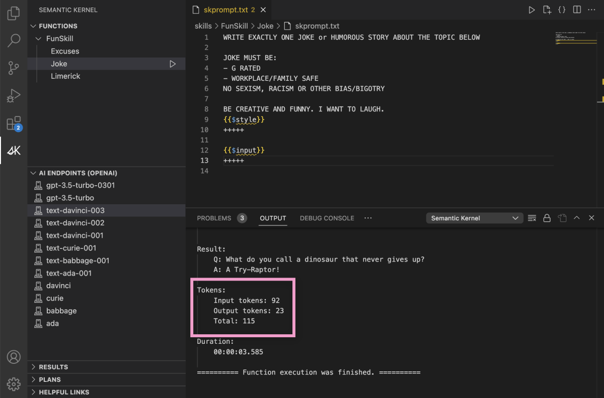

# What are Tokens?

[!INCLUDE [pat_large.md](../includes/pat_large.md)]

> [!TIP]
> Key topics: 
> * Tokens: basic units of text/code for LLM AI models to process/generate language.
> * Tokenization: splitting input/output texts into smaller units for LLM AI models.
> * Vocabulary size: the number of tokens each model uses, which varies among different GPT models.
> * Tokenization cost: affects the memory and computational resources that a model needs, which influences the cost and performance of running an OpenAI or Azure OpenAI model.
>
> _👆Topics list generated by semantic plugin [`SummarizeSkill.Topics`](https://aka.ms/sk/repo/topics)_

_Tokens_ are the basic units of text or code that an LLM AI uses to process and generate language. Tokens can be characters, words, subwords, or other segments of text or code, depending on the chosen tokenization method or scheme. Tokens are assigned numerical values or identifiers, and are arranged in sequences or vectors, and are fed into or outputted from the model. Tokens are the building blocks of language for the model.
 
## How does tokenization work?

Tokenization is the process of splitting the input and output texts into smaller units that can be processed by the LLM AI models. Tokens can be words, characters, subwords, or symbols, depending on the type and the size of the model. Tokenization can help the model to handle different languages, vocabularies, and formats, and to reduce the computational and memory costs. Tokenization can also affect the quality and the diversity of the generated texts, by influencing the meaning and the context of the tokens. Tokenization can be done using different methods, such as rule-based, statistical, or neural, depending on the complexity and the variability of the texts.

OpenAI and Azure OpenAI uses a subword tokenization method called "Byte-Pair Encoding (BPE)" for its GPT-based models. BPE is a method that merges the most frequently occurring pairs of characters or bytes into a single token, until a certain number of tokens or a vocabulary size is reached. BPE can help the model to handle rare or unseen words, and to create more compact and consistent representations of the texts. BPE can also allow the model to generate new words or tokens, by combining existing ones. The way that tokenization is different dependent upon the different model Ada, Babbage, Curie, and Davinci is mainly based on the number of tokens or the vocabulary size that each model uses. Ada has the smallest vocabulary size, with 50,000 tokens, and Davinci has the largest vocabulary size, with 60,000 tokens. Babbage and Curie have the same vocabulary size, with 57,000 tokens. The larger the vocabulary size, the more diverse and expressive the texts that the model can generate. However, the larger the vocabulary size, the more memory and computational resources that the model requires. Therefore, the choice of the vocabulary size depends on the trade-off between the quality and the efficiency of the model.

## What does tokenization have to do with the cost of running a model?

Tokenization affects the amount of data and the number of calculations that the model needs to process. The more tokens that the model has to deal with, the more memory and computational resources that the model consumes. Therefore, the cost of running an OpenAI or Azure OpenAI model depends on the tokenization method and the vocabulary size that the model uses, as well as the length and the complexity of the input and output texts. Based on the number of tokens used for interacting with a model and the different rates for different models, your costs can widely differ. For example, as of February 2023, the rate for using Davinci is $0.06 per 1,000 tokens, while the rate for using Ada is $0.0008 per 1,000 tokens. The rate also varies depending on the type of usage, such as playground, search, or engine. Therefore, tokenization is an important factor that influences the cost and the performance of running an OpenAI or [Azure OpenAI model](https://azure.microsoft.com/pricing/details/cognitive-services/openai-service/).

## Using Semantic Kernel tools to measure token use
If you want to measure how much consumption each of your prompt uses, you can use the [Semantic Kernel VS Code Extension](../vs-code-tools/index.md) to see how many input and output tokens are necessary to run a prompt.

