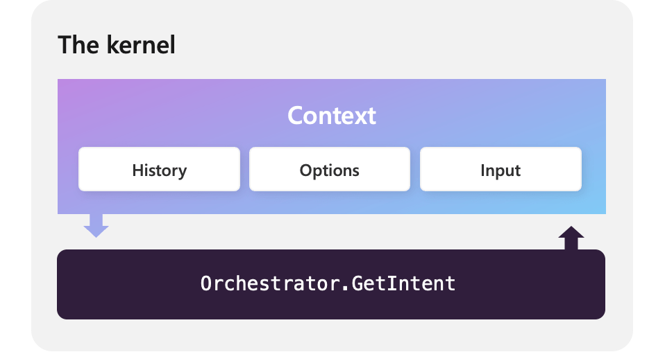

# Templatizing your prompts


In the [previous article](./your-first-prompt.md) we created a prompt that could be used to get the intent of the user. This function, however, is not very reusable. Because the options are hard coded in. We could dynamically create the prompts string, but there's a better way: prompt templates. function.

By following this example, you'll learn how to templatize a prompt. If you want to see the final solution, you can check out the following samples in the public documentation repository. Use the link to the previous solution if you want to follow along.

| Language  | Link to previous solution | Link to final solution |
| --- | --- |
| C# | [Open solution in GitHub](https://github.com/MicrosoftDocs/semantic-kernel-docs/tree/main/samples/dotnet/04-Serializing-Semantic-Functions) | [Open solution in GitHub](https://github.com/MicrosoftDocs/semantic-kernel-docs/tree/main/samples/dotnet/04-Templatizing-Prompts) |
| Python | [Open solution in GitHub](https://github.com/MicrosoftDocs/semantic-kernel-docs/tree/main/samples/python/04-Serializing-Semantic-Functions) | [Open solution in GitHub](https://github.com/MicrosoftDocs/semantic-kernel-docs/tree/main/samples/python/04-Templatizing-Prompts) |

## Adding variables to the prompt
With Semantic Kernel's templating language, we can add tokens that will be automatically replaced with input parameters. To begin, let's update our prompt from the previous article so it has tokens for the input, options, and history. In Semantic Kernel, tokens are surrounded by double curly braces and a dollar sign `{{$...}}`.

# [C#](#tab/Csharp)

:::code language="csharp" source="~/../samples/dotnet/04-Templatizing-Prompts/Program.cs" range="5-6, 8, 33-45" highlight="6, 14-15":::

# [Python](#tab/python)

:::code language="python" source="~/../samples/python/04-Templatizing-Prompts/main.py" range="17-29" highlight="3,11-12":::

---


:::row:::
   :::column span="2":::
      The new prompt uses the `options` variable to provide a list of options for the LLM to choose from. We've also added `input` and `history` variables to the prompt so the conversation can be included.
      
      By including these variables, we are able to help the LLM choose the correct intent by providing it with more context and a constrained list of options to choose from.

      You can now run your template using named arguments.
   :::column-end:::
   :::column span="3":::
      
   :::column-end:::
:::row-end:::

# [C#](#tab/Csharp)

:::code language="csharp" source="~/../samples/dotnet/04-Templatizing-Prompts/Program.cs" range="17-22, 26-27, 30-32, 47-60" highlight="20-22":::

# [Python](#tab/python)

:::code language="python" source="~/../samples/python/04-Templatizing-Prompts/main.py" range="6-10, 12-16, 30-47" highlight="13-18,24":::

---

## Using the Handlebars template engine
In addition to the core template syntax, Semantic Kernel also comes with support for the Handlebars templating language in the C# SDK. To use Handlebars, you'll first want to add the Handlebars package to your project.

```console
dotnet add package Microsoft.SemanticKernel.PromptTemplate.Handlebars
```

Afterwards, you can create a new prompt using the `HandlebarsPromptTemplateFactory`. Because Handlebars supports loops, we can use it to loop over the examples and chat history.

:::code language="csharp" source="~/../samples/dotnet/04-Templatizing-Prompts/Program.cs" range="5-8, 86-108" highlight="12-16,18-20,29":::

We can then create the example and chat history objects that will be used by the template.

:::code language="csharp" source="~/../samples/dotnet/04-Templatizing-Prompts/Program.cs" range="65-83":::

Finally, you can run the prompt using the kernel. Notice how we're using the `InvokeAsync` instead of `InvokePromptAsync` since we've already turned the prompt string into a function.

:::code language="csharp" source="~/../samples/dotnet/04-Templatizing-Prompts/Program.cs" range="114-123" highlight="1":::

## Take the next step
Now that you can templatize your prompt, you can now learn how to call functions from within
a prompt to help break up the prompt into smaller pieces.

> [!div class="nextstepaction"]
> [Call nested functions](./calling-nested-functions.md)