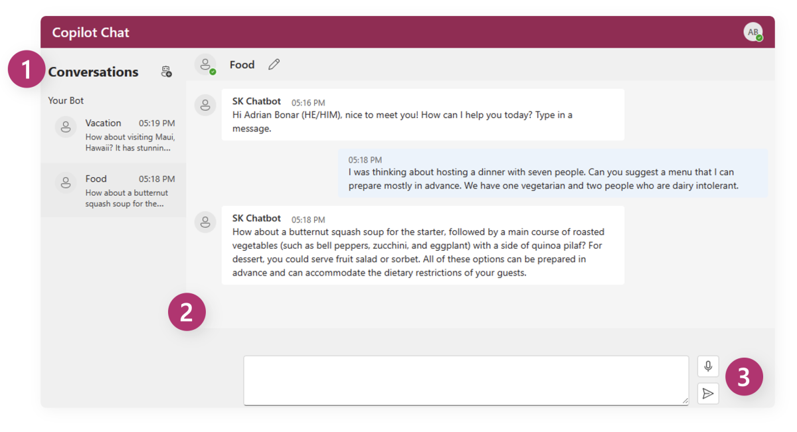

# Copilot Chat Sample App

[!INCLUDE [subheader.md](../includes/pat_large.md)]

The Copilot Chat sample allows you to build your own integrated large language model chatbot.  This is an enriched intelligence app, with multiple dynamic components including command messages, user intent, and memories.  

The chat prompt and response will evolve as the conversation between the user and the application proceeds.  This chat experience uses a chat plugin containing multiple functions that work together to construct the final prompt for each exchange.

> [!IMPORTANT]
> Each function will call OpenAI which will use tokens that you will be billed for. 

## Requirements to run this app

> [!div class="checklist"]
> * [Visual Studio Code](https://code.visualstudio.com/Download)
> * [Git](https://git-scm.com/book/en/v2/Getting-Started-Installing-Git)
> * [.NET 6.0](https://dotnet.microsoft.com/en-us/download/dotnet/6.0)
> * [Node.js](https://nodejs.org/en/download)
> * [Yarn](https://classic.yarnpkg.com/lang/en/docs/install)

## Running the app
The [Copilot Chat Sample App](https://github.com/microsoft/semantic-kernel/blob/main/samples/apps/copilot-chat-app/README.md) is located in the Semantic Kernel GitHub repository.

1) Follow the [Setup](/semantic-kernel/get-started) instructions if you do not already have a clone of Semantic Kernel locally.
2) Follow the instructions to [Register an Azure Application](/azure/active-directory/develop/quickstart-register-app)
3) Open the ReadMe file in the Copilot Chat sample folder.
4) Follow the ReadMe instructions to configure, start, and test the Backend API Server
5) Follow the ReadMe instructions to start the front end WebApp
5) A browser should automatically launch and navigate to https://localhost:3000. with the sample app running

## Exploring the app
With the Copilot Chat sample app running, you can start interacting with the chatbot.  The app will start with a default conversation thread where you can ask it questions.

| Feature | Name | Description |
|:-|:-|:-|
| **1** | Conversation Pane | The left portion of the screen shows different conversation threads the user is holding with the chatbot.  To start a new conversation, click the '+'Bot symbol. |
| **2** | Conversation Thread | Chatbot responses will appear in the main conversation thread, along with a history of your prompts.   Users can scroll up and down to review a complete conversation history. |
| **3** | Prompt Entry Box | The bottom of the screen contains the prompt entry box, where users can type their prompts, and click the "Send" icon to the right of the box when ready to send it to the bot. |

## Next step

If you've tried all the apps and are excited to see more, please star the GitHub repo and join the Semantic Kernel community!

> [!div class="nextstepaction"]
> [Star the Semantic Kernel repo](https://aka.ms/sk/repo)
