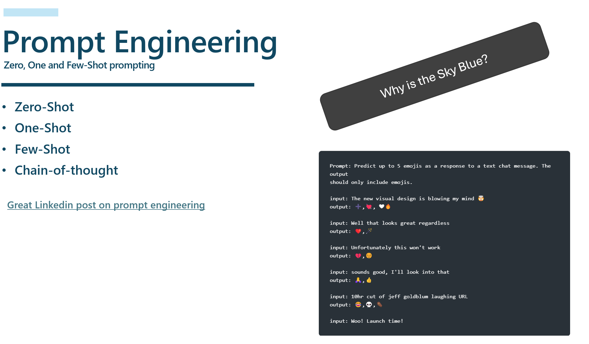
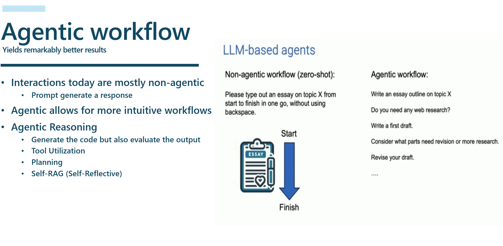
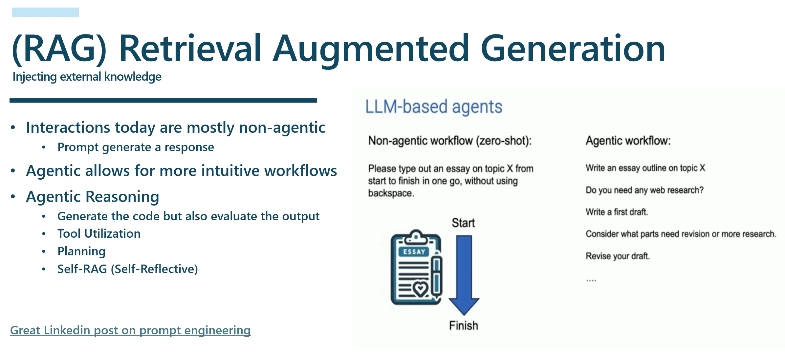
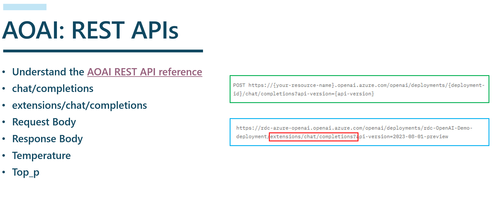
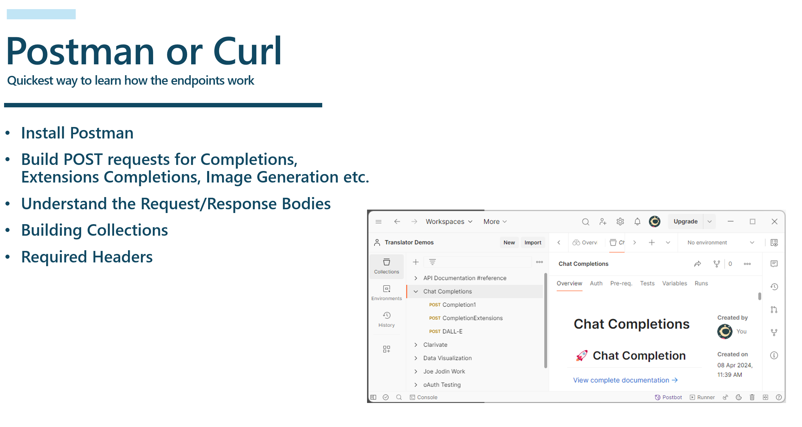
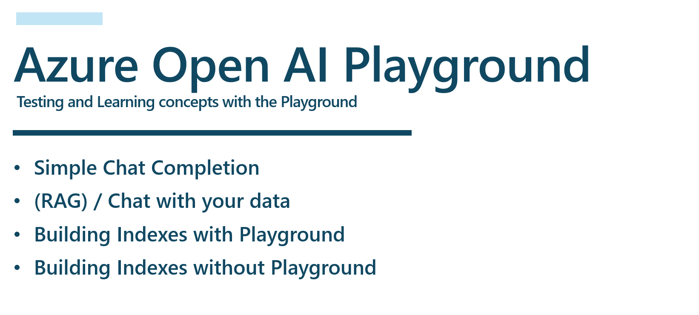

# Semantic-Kernel - Fundamentals
Learn Semantic Kernel using basics to advance concepts

# AI Fundamentals - Basics to Advanced
We start out by covering the fundemental concepts of Prompt Engineering, then we move into using Postman to understand the request/response bodies as well as the APIs.  Next, we move into writing our first Chat Completion app using the Azure OpenAI SDK, then we use the same logic, but with the Semantic Kernel and to top it all off, we enhance our soluton using Semantic Kernel Plugins.

## Summary
This session is designed to dive into the fundamentals of AI.  Just like building a house, you need to have a strong foundation, so if you want to be a solid developer of AI solutions, it’s very important to have a strong understanding of the fundamentals.

We are going to cover the following topics:
- Prompt Engineering; Zero-shot, One-shot, Few-shot, and many-shot learning   
- Agentic Workflow; How it will play an imporant role in the future of AI
- RAG (Retrieval Augmented Generation) and how it can be used to improve your AI solutons
- Understanding Chat Completion and Extensions Completion Endpoints
- Using Postman and Curl to learn the basic concepts
- Using the Azure OpenAI Playgound to learn the basic concepts
- Let's dive into some actual code and take a look at the various ways you can use the Semantic Kernel to build AI solutions

## Prompt Engineering 
Understanding the basics of Prompt Engineering is critical to building AI solutions.  The following are the basic types of Prompt Engineering that you need to understand:
Zero-shot, Few-shot, One-shot, Few-shot, and many-shot learning.

You can find a really good [LinkedIn article on this topic here](https://www.linkedin.com/pulse/zero-shot-one-few-learning-prompt-engineering-pathan/).

## Agentic Workflow
Agentic workflow is a new way of leveraging the power of LLMs.  Here is an example of an agentic workflow:
- You provide a task, 
- Plan the steps needed
- Writes a first draft
- Does some reflection, makes changes then completes the task.   

## RAG (Retrieval Augmented Generation
RAG is one of the most important patterns that is being used with the LLMs today.  For example, if you invoke a plugin to retrieve some data then you hand that data to the LLM for summarization, you are using RAG.  It qualifies as RAG if are you retrieve any data that the LLM has no knowledge of then you use that information with the LLM.  A good example would be allowing your Chat Bot to provide weather information.  LLMs cannot tell you want the current weather is based on the knowledge they have been trained on, it has to be injected into the prompt.  Let's actually break down what RAG really means:

- Retrieval = retrieve information from a data source 
- Augment = add this date to the prompt
- Generation = allow for generation of better responses using the retrieved data.

## AOAI REST APIs
In order to build a solid AI solution, you need to understand the basics of the REST APIs that are available to you.  The following are the basic REST APIs that you need to understand:
- Chat Completion
- Extensions Completion
- As well as any of the other AI REST APIs that you will be using in your solution

I recommend that you use Postman or Curl to test these APIs before you start coding.  This will give you a good understanding of how the APIs work and what you can expect from them.
I suggest that you read through the [Azure OpenAI REST API documentation](https://learn.microsoft.com/en-us/azure/ai-services/openai/reference#chat-completions) to get a good understanding of how to use the APIs.

## Postman and Curl
I suggest that you build out a Postman Collection that you can use to test the various APIs.  This will give you a good understanding of how the APIs work and what you can expect from them.  You can also use Curl to test the APIs from the command line.

## Azure Open AI Playground
The next step is to use the Azure Open AI Playground to get a better understand of what a Chat Experience might look like.  This will give you a good understanding of what to expect, and you can actually setup a "Chat with your Data" style Chat experience.  You can actually "Deploy to Web App" right from the Azure Open AI Playground.

            

## Code Samples
Now, lets dive into some actual code and take a look at the various ways you can use create AI based solutions using the AI APIs.  We can leverage the Azure Open AI SDK, we could use an HTTP Client and call the APIs directly, or we can use an orchestrator like Semantc Kernel, which is what I recommend.

### Azure Open AI SDK to call the Chat Completion API
Below is a very simple example of using the Azure Open AI SDK to call the Chat Completion API. 
You will need to install the Azure Open AI SDK using the following command:
**dotnet add package Azure.AI.OpenAI --prerelease**
 

    
<u>Example</u> (<i>click to expand</i>)

    <!-- have to be followed by an empty line! -->

        using Azure;
        using Azure.AI.OpenAI;
        using System.Configuration;

        // See https://aka.ms/new-console-template for more information
        Console.WriteLine("Hello, this is our first Azure OpenAI Application ");

        #region Step 1 - Populate Azure OpenAI Configuration variables
        var openAiDeployment = ConfigurationManager.AppSettings.Get("AzureOpenAIModel");
        var openAiUri = ConfigurationManager.AppSettings.Get("AzureOpenAIEndpoint");
        var openAiApiKey = ConfigurationManager.AppSettings.Get("AzureOpenAIKey");
        #endregion

        #region Step 2 - Create an OpenAI client
        OpenAIClient client = new OpenAIClient(
                  new Uri(openAiUri!),
                  new AzureKeyCredential(openAiApiKey!));
        #endregion

        #region Step 3 - Create a ChatCompletionsOptions object
        var chatCompletionsOptions = new ChatCompletionsOptions()
        {
            DeploymentName = openAiDeployment, // Use DeploymentName for "model" with non-Azure clients
            Messages =
            {
                // The system message represents instructions or other guidance about how the assistant should behave
                new ChatRequestSystemMessage("You are a helpful assistant. You will talk like a pirate."),
                // User messages represent current or historical input from the end user
                new ChatRequestUserMessage("Can you help me?"),
                // Assistant messages represent historical responses from the assistant
                new ChatRequestAssistantMessage("Arrrr! Of course, me hearty! What can I do for ye?"),
                new ChatRequestUserMessage("What's the best way to train a parrot?"),
            }
        };
        #endregion

        #region Step 4 - Call the GetChatCompletionsAsync method
        Response<ChatCompletions> response = await client.GetChatCompletionsAsync(chatCompletionsOptions);
        #endregion

        #region Step 5 - Display the response
        ChatResponseMessage responseMessage = response.Value.Choices[0].Message;
        Console.WriteLine($"[{responseMessage.Role.ToString().ToUpperInvariant()}]: {responseMessage.Content}");
        #endregion
          
  

[Click here to be taken to the Azure Open AI SDK solution](/ConsoleApp-AOAI-SDK/README.md)

### Semantic Kernel to call the Chat Completion API
Using the exact same logic let's create the sample soluton but using Semantic Kernel.  This is a much more powerful way to build AI solutions.
 

    
<u>Example</u> (<i>click to expand</i>)

    <!-- have to be followed by an empty line! -->

    // Create a Builder for Creating Kernel Objects
    var builder = Kernel.CreateBuilder();
    
    // Load AI Endpoint Values
    var openAiDeployment = ConfigurationManager.AppSettings.Get("AzureOpenAIModel");
    var openAiUri = ConfigurationManager.AppSettings.Get("AzureOpenAIEndpoint");
    var openAiApiKey = ConfigurationManager.AppSettings.Get("AzureOpenAIKey");

    // Add ChatCompletion Service
    builder.Services.AddAzureOpenAIChatCompletion(
       deploymentName: openAiDeployment!,
       endpoint: openAiUri!,
       apiKey: openAiApiKey!);
    
    // Construct Kernel, ChatHistory Get instance of ChatCompletion Service
    var kernel = builder.Build();
    ChatHistory history = [];
    history.AddSystemMessage("You are a helpful assistant. You will talk like a pirate.");
    history.AddUserMessage("Can you help me?");
    history.AddAssistantMessage("Arrrr! Of course, me hearty! What can I do for ye?");
    history.AddUserMessage("What's the best way to train a parrot?");
    var chatCompletionService = kernel.GetRequiredService<IChatCompletionService>();

    // Step 5 Send Prompt Get Respons
    var prompt = "Why is the Sky blue?";
    var result = await chatCompletionService.GetChatMessageContentAsync(history);
    Console.WriteLine(result);
    Console.WriteLine("\nPress enter to end.");
    Console.ReadLine();
  

  [Click here to be taken to the Semantic Kernel solution](/ConsoleApp-SK-First-App/README.md)

  ### Advanced - Semantic Kernel Chat Completion API with Plugins
  Using the exact same logic, but now let's extend our capabilities by adding a plugins to our logic and also creating a Chat loop.
  

    
<u>Example</u> (<i>click to expand</i>)

    <!-- have to be followed by an empty line! -->

     
        // Create a Builder for Creating Kernel Objects
        var builder = Kernel.CreateBuilder();
    
        // Load AI Endpoint Values
        var openAiDeployment = ConfigurationManager.AppSettings.Get("AzureOpenAIModel");
        var openAiUri = ConfigurationManager.AppSettings.Get("AzureOpenAIEndpoint");
        var openAiApiKey = ConfigurationManager.AppSettings.Get("AzureOpenAIKey");

        // Add ChatCompletion Service
        builder.Services.AddAzureOpenAIChatCompletion(
           deploymentName: openAiDeployment!,
           endpoint: openAiUri!,
           apiKey: openAiApiKey!);

        // Add our Plugins
        builder.Plugins.AddFromType<UniswapV3SubgraphPlugin>();
        builder.Plugins.AddFromType<LightOnPlugin>();
        builder.Plugins.AddFromType<WeatherPlugin>();
        
        // Construct Kernel, ChatHistory Get instance of ChatCompletion Service
        var kernel = builder.Build();
        ChatHistory history = [];
        var chatCompletionService = kernel.GetRequiredService<IChatCompletionService>();

        // Create Chat Loop
        while (true)
        {
            Console.Write(">> ");
            var userMessage = Console.ReadLine();
            if (userMessage != "Exit")
            {
                history.AddUserMessage(userMessage!);

                // Not really being used in this example but we will use it in future examples
                OpenAIPromptExecutionSettings openAIPromptExecutionSettings = new()
                {
                    ToolCallBehavior = ToolCallBehavior.AutoInvokeKernelFunctions
                };

                try
                {
                    var result = await chatCompletionService.GetChatMessageContentAsync(
                        history,
                        executionSettings: openAIPromptExecutionSettings,
                        kernel: kernel);

                    Console.WriteLine("<< " + result);

                    if (result.Content != null)
                    {
                        history.AddAssistantMessage(result.Content);
                    }
                }
                catch (Exception ex)
                {
                    Console.WriteLine($"Error: {ex.Message}");
                }
            }
            else break;
        }
  

