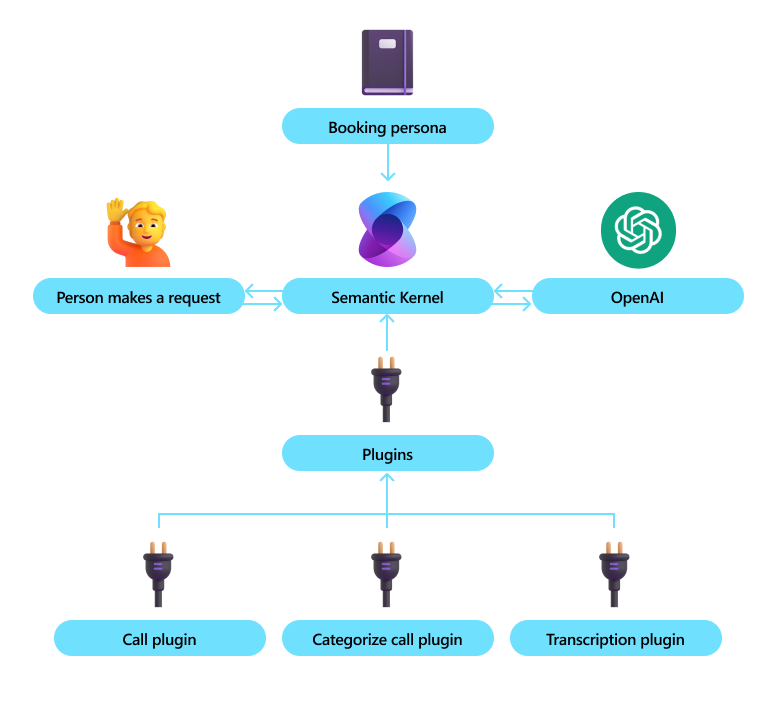
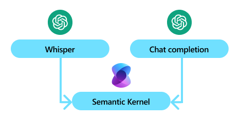
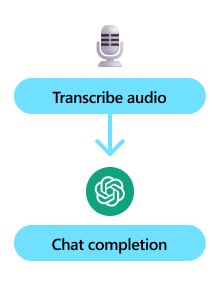
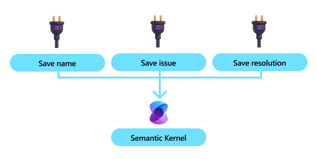
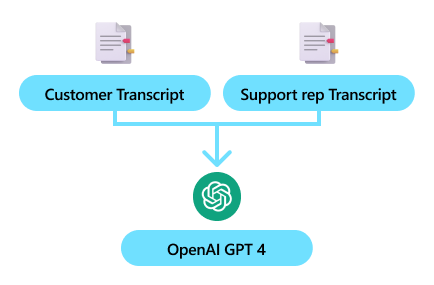

#  Use Case - Call Center (Audio to Text)

# Scenario

Many companies leverage call centers to help their customers. With Semantic Kernel, you can help automate some of the processes within a call center to make call center employees more productive. Examples include using the call transcription to…
-	Automatically populating user details 
-	Automatically retrieving relevant data
-	Automatically request approvals to ameliorate the customer
-	Automatically classify the call once it’s done

Since Semantic Kernel provides connections with speech-to-text services and the ability for agents to perform actions automatically with automatic function calling, you can implement this entire scenario with the Semantic Kernel SDK.

# Architecting the Solution

To build this solution, you would want to create a kernel with the necessary AI services so that it can understand what is being discussed on the call and the plugins necessary for the AI to start automating processes. 

In this sample, you could leverage Whisper and a chat completion service from OpenAI.

Once you have the models loaded into your app, you can use them to transcribe audio from the call with the customer. Below is an example of transcribing an MP3 of a customer help call.

After transcribing the audio, you can then pass it on to the chat completion model so that it can start automatically processing the information. Before we do, however, we’ll first want to give the agent the necessary plugins to complete its tasks. For example, we could provide it with a plugin that allows it to notate key call information (e.g., name, issue, resolution).

Once we have the plugins, we can load them into the kernel so the AI can start using them. To improve the AI’s ability to use the plugins, we’ll also add a persona to it using a system message.

Finally, we can route the transcription to the AI. To get the best results, you can break up the transcription by speaker and let the AI know about the different people (customer and support representative) using the name property.
> Note: the name property is currently only supported by OpenAI models.

// Show code sending the transcription to the chat completion model

If you run this code with the this audio file, you should get a final chat history that looks like the following:

// Show JSON representation of chat history