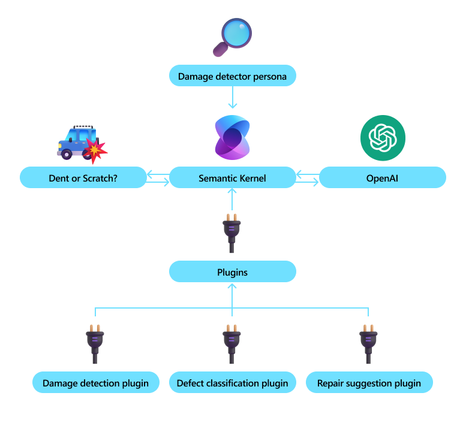

# Use Case - Image to Text

# Scenario

Many companies have scenarios in their day-to-day operation where they generate text from images and can use Image to Text functionality to save time. For example, a car rental company would assess images of cars returned for damage and the scale of damage. 

After each car rental is complete, Contoso car rental company must assess the vehicle for any damage and necessary repairs before going on to rent the car to the next customer. If the car body has damage for example the severity of the damage has to be categorized (scratch vs. large dent). Assessing each car is a time-consuming process today as individuals must take pictures of the car and damage, categorize damage and submit it for next steps. 

Using Semantic Kernel, Contoso car rental company was able to automate this process using AI and save employees’ time. 

Learn more about Image to Text in this blog post [here](https://devblogs.microsoft.com/semantic-kernel/image-to-text-with-semantic-kernel-and-huggingface/).