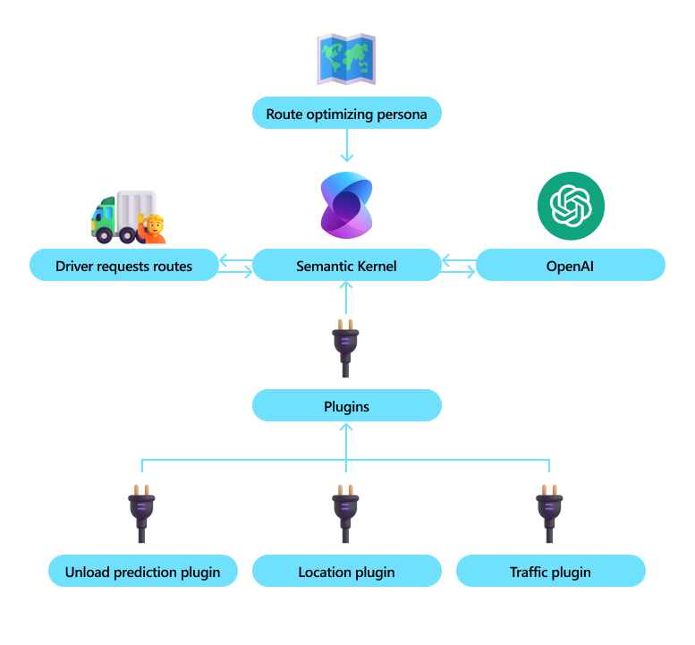

#  Use Cases - Collaboration Supply Chain Optimization of a system

Contoso supply chain company focused on optimization of their shipyard operations and loading of crates from the shipyard to delivery semi-trucks. 

