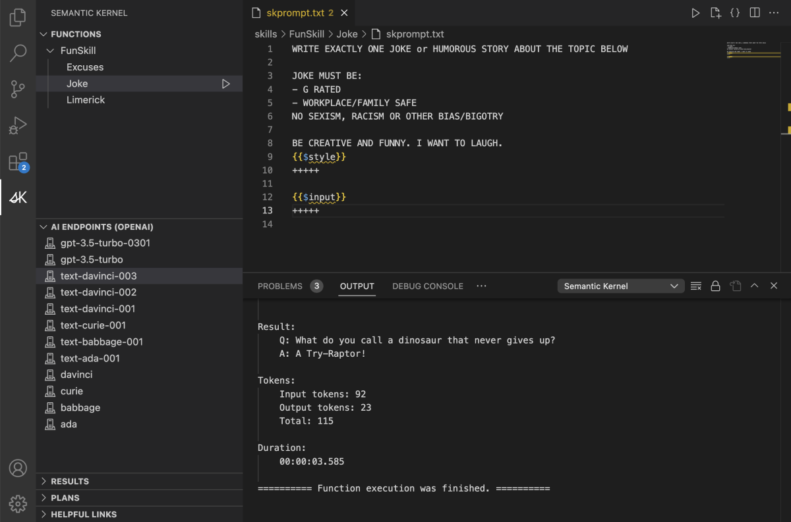

# Visual Studio Code Semantic Kernel Extension

The Semantic Kernel Tools help developers to write prompts for [Semantic Kernel](https://github.com/microsoft/semantic-kernel).

## These tools simplify Semantic Kernel development
With the Semantic Kernel Tools, you can easily create new prompts and test them without needing to write any code. Behind the scenes, the tools use the Semantic Kernel SDK so you can easily transition from using the tools to integrating your prompts into your own code.

In the following image you can see how a user can easily view all of their prompts, edit them, and run them from within Visual Studio Code using any of the supported AI endpoints.

## Installing the Semantic Kernel Extension

To get started with Semantic Kernel Tools, follow these simple steps:
1. Ensure that you have [Visual Studio Code](https://code.visualstudio.com/) installed on your computer.
2. Open Visual Studio Code and press Shift+Control+X to bring up the [Extensions marketplace](https://marketplace.visualstudio.com/).
3. In the Extensions menu, search for "[Semantic Kernel Tools](https://marketplace.visualstudio.com/items?itemName=ms-semantic-kernel.semantic-kernel)".
4. Select Semantic Kernel Tools from the search results and click the Install button.
  :::image type="content" source="../media/semantic-kernel-tools-install.png" alt-text="Semantic Kernel Tools Extension":::
5. Wait for the installation to complete, then restart Visual Studio Code.

## Connecting the extension to your AI endpoint

First you must configure an AI endpoint to be used by the Semantic Kernel

Open the Command Palette i.e., View -> Command Palette or Ctrl+Shift+P
1.  If you have access to an Azure subscription that contains the Azure OpenAI resource you want to use:
2. Type "Add Azure OpenAI Endpoint" and you will be prompted for the following information:
 - Endpoint type, select "completion"
 - Allow the extension to sign in to Azure Portal
 - Select the subscription to use
 - Select the resource group which contains the Azure OpenAI resource
 - Select the Azure OpenAI resource
 - Select the Azure OpenAI model
3. If you have the details of an Azure OpenAI endpoint that you want to use
 - Type "Add AI Endpoint" and you will be prompted for the following information:
 - Endpoint type, select "completion"
 - Completion label, the default of "Completion" is fine
 - Completion AI Service, select AzureOpenAI
 - Completion deployment or model id e.g., text-davinci-003
 - Completion endpoint URI e.g., https://contoso-openai.azure.com/
 - Completion endpoint API key (this will be stored in VS Code secure storage)
4. If you have the details of an OpenAI endpoint that you want to use
 - Type "Add AI Endpoint" and you will be prompted for the following information:
 - Endpoint type, select "completion"
 - Completion label, the default of "Completion" is fine
 - Completion AI Service, select OpenAI
 - Completion deployment or model id e.g., text-davinci-003
 - Completion endpoint API key (this will be stored in VS Code secure storage)

Once you have a AI endpoint configured proceed as follows:

1. Select the semantic function you want to execute
2. Select the "Run Function" icon which is shown in the Functions view
3. You will be prompted to enter any arguments the semantic function requires
4. The response will be displayed in the Output view in the "Semantic Kernel" section

## Create a semantic function

1. Once you have installed the Semantic Kernel Tools extension you will see a new Semantic Kernel option in the activity bar
 - We recommend you clone the semantic-kernel repository and open this in your VS Code workspace
2. Click the Semantic Kernel icon to open Semantic Kernel Functions view
3. Click the "Add Semantic Plugin" icon in the Semantic Kernel Functions view title bar
4. You will be prompted to select a folder
 - This will be the location of the plugin which will contain your new Semantic Function
 - Create a new folder called MyPlugin1 in this directory &lt;location of your clone&gt;\semantic-kernel\samples\plugins
 - Select this new folder as your Plugin folder
5. You will be prompted for a function name, enter MyFunction1
6. You will be prompted for a function description2
7. A new prompt text file will be automatically created for your new function
8. You can now enter your prompt.

### Troubleshooting

- Enabling Trace Level Logs
 - You can enable trace level logging for the Semantic Kernel using the following steps:
  1. Open settings (Ctrl + ,)
  2. Type "Semantic Kernel"
  3. Select Semantic Kernel Tools -> Configuration
  4. Change the log level to “Trace”
  5. Repeat the steps to execute a semantic function and this time you should see trace level debugging of the semantic kernel execution

Below is a list of possible errors you might receive and details on how to address them.

Errors creating a Semantic Function
- Unable to create function prompt file for &lt;name&gt;
 - An error occurred creating the skprompt.txt file for a new semantic function. Check you can create new folders and files in the location specified for the semantic function.
- Function &lt;name&gt; already exists. Found function prompt file: &lt;file name&gt;
 - A skprompt.txt file already exists for the semantic function you are trying to create. Switch to the explorer view to find the conflicting file.
- Unable to create function configuration file for &lt;file name&gt;
 - An error occurred creating the config.json file for a new semantic function. Check you can create new folders and files in the location specified for the semantic function.
- Configuration file for &lt;file&gt; already exists. Found function config file: &lt;file name&gt;
 - A config.json file already exists for the semantic function you are trying to create. Switch to the explorer view to find the conflicting file.

Errors configuring an AI Endpoint
- Unable to find any subscriptions. Please log in with a user account that has access to a subscription where OpenAI resources have been deployed.
 - The user account you specified to use when logging in to Microsoft does not have access to any subscriptions. Please try again with a different account.
- Unable to find any resource groups. Please log in with a user account that has access to a subscription where OpenAI resources have been deployed.
 - The user account you specified to use when logging in to Microsoft does not have access to any resource groups in the subscription you selected. Please try again with a different account or a different subscription.
- Unable to find any OpenAI resources. Please log in with a user account that has access to a subscription where OpenAI resources have been deployed.
 - The user account you specified to use when logging in to Microsoft does not have access to any Azure OpenAI resources in the resource group you selected. Please try again with a different account or a different resource group.
- Unable to find any OpenAI model deployments. Please log in with a user account that has access to a subscription where OpenAI model deployments have been deployed.
 - The user account you specified to use when logging in to Microsoft does not have access to any deployment models in the Azure OpenAI resource you selected. Please try again with a different account or a different Azure OpenAI resource.
- Unable to access the Azure OpenAI account. Please log in with a user account that has access to an Azure OpenAI account.
 - The user account you specified to use when logging in to Microsoft does not have access to the Azure OpenAI account in the Azure OpenAI resource you selected. Please try again with a different account or a different Azure OpenAI resource.
- Unable to access the Azure OpenAI account keys. Please log in with a user account that has access to an Azure OpenAI account.
 - The user account you specified to use when logging in to Microsoft does not have access to the Azure OpenAI account keys in the Azure OpenAI resource you selected. Please try again with a different account or a different Azure OpenAI resource.
- Settings does not contain a valid AI completion endpoint configuration. Please run the "Add Azure OpenAI Enpoint" or "Add AI Endpoint" command to configure a valid endpoint.
 - You have not configured an AI endpoint. Please refer to the first part of the Execute a Semantic Function section above.

Errors executing a Semantic Function
- ModelNotAvailable – unable to fetch the list of model deployments from Azure (Unauthorized)
 - This failure comes when calling the Azure OpenAI REST API. Check the AzureOpenAI resource you are using is correctly configured.

### Take the next step

Now you can start building your own Semantic Functions

> [!div class="nextstepaction"]
> [It all starts with an ask](/semantic-kernel/howto/semanticfunctions)

